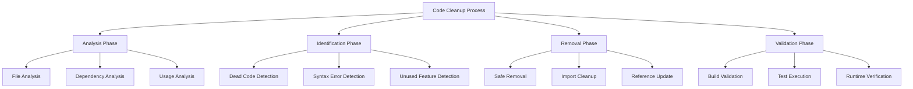
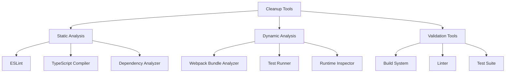

# Code Cleanup and Maintenance Design Document

## Overview

This design document outlines the technical approach for performing a comprehensive code cleanup and maintenance operation on the Wendeal Dashboard. The process involves systematic analysis, identification, and removal of dead code, syntax error correction, and elimination of unused features to improve code quality and maintainability.

## Technical Standards Alignment

### Frontend Framework Standards
- React 18 with TypeScript strict mode
- ESLint and Prettier configuration adherence
- Consistent import/export patterns
- Standardized error handling

### Code Quality Standards
- Zero TypeScript compilation errors
- Full ESLint compliance
- Consistent code formatting
- Comprehensive test coverage

## Code Reuse Analysis

### Existing Tools and Scripts
- **ESLint**: Reuse existing linting configuration for error detection
- **TypeScript Compiler**: Leverage tsc for type checking and error identification
- **Jest**: Utilize existing test framework for validation
- **Build Scripts**: Use existing npm scripts for compilation and bundling

### Utility Functions
- **File System Utils**: Reuse existing file operations
- **Path Resolution**: Use existing path utilities
- **Logging**: Leverage existing logging mechanisms
- **Error Handling**: Apply existing error patterns

## Architecture

### Cleanup Process Architecture



### Tool Integration Architecture



## Components and Interfaces

### 1. CodeAnalyzer (代码分析器)

**Purpose:** Performs comprehensive analysis of the codebase to identify issues

**Location:** `src/utils/codeCleanup/CodeAnalyzer.ts`

```typescript
interface CodeAnalyzer {
  analyzeFiles(patterns: string[]): AnalysisResult;
  checkSyntax(file: string): SyntaxCheckResult;
  findUnusedImports(file: string): UnusedImport[];
  detectDeadCode(): DeadCodeResult;
}

interface AnalysisResult {
  totalFiles: number;
  filesWithErrors: number;
  unusedImports: UnusedImport[];
  syntaxErrors: SyntaxError[];
  deadCode: DeadCodeResult;
  recommendations: string[];
}
```

### 2. DependencyResolver (依赖解析器)

**Purpose:** Analyzes module dependencies and identifies unused modules

**Location:** `src/utils/codeCleanup/DependencyResolver.ts`

```typescript
interface DependencyResolver {
  resolveDependencies(): DependencyGraph;
  findUnusedModules(): string[];
  checkCircularDependencies(): CircularDependency[];
  validateImports(): ImportValidationResult;
}

interface DependencyGraph {
  nodes: ModuleNode[];
  edges: DependencyEdge[];
  isolatedModules: string[];
}
```

### 3. CodeRemover (代码移除器)

**Purpose:** Safely removes identified dead code and unused files

**Location:** `src/utils/codeCleanup/CodeRemover.ts`

```typescript
interface CodeRemover {
  removeFile(filePath: string): RemovalResult;
  removeUnusedImports(filePath: string, imports: string[]): RemovalResult;
  updateReferences(oldPath: string, newPath: string): UpdateResult;
  createBackup(): BackupResult;
}

interface RemovalResult {
  success: boolean;
  filesAffected: string[];
  errors: string[];
  rollbackAvailable: boolean;
}
```

### 4. ValidationRunner (验证运行器)

**Purpose:** Validates the cleaned codebase

**Location:** `src/utils/codeCleanup/ValidationRunner.ts`

```typescript
interface ValidationRunner {
  runBuild(): BuildResult;
  runTests(): TestResult;
  checkLints(): LintResult;
  validateRuntime(): RuntimeValidationResult;
}

interface BuildResult {
  success: boolean;
  duration: number;
  bundleSize: number;
  warnings: string[];
  errors: string[];
}
```

## Data Models

### Analysis Results Data Model

```typescript
interface CleanupAnalysis {
  timestamp: string;
  duration: number;
  filesAnalyzed: number;
  issuesFound: {
    syntaxErrors: number;
    unusedImports: number;
    deadCode: number;
    unusedFiles: number;
    circularDeps: number;
  };
  recommendations: CleanupRecommendation[];
  riskAssessment: RiskLevel;
}

interface CleanupRecommendation {
  id: string;
  type: 'remove' | 'fix' | 'refactor' | 'review';
  file: string;
  description: string;
  severity: 'low' | 'medium' | 'high' | 'critical';
  automated: boolean;
  impact: string;
}

type RiskLevel = 'low' | 'medium' | 'high' | 'critical';
```

### Cleanup Report Data Model

```typescript
interface CleanupReport {
  analysis: CleanupAnalysis;
  actions: CleanupAction[];
  results: CleanupResult;
  metrics: CleanupMetrics;
}

interface CleanupAction {
  id: string;
  type: 'file_removal' | 'import_cleanup' | 'syntax_fix' | 'config_update';
  target: string;
  description: string;
  executed: boolean;
  success: boolean;
  error?: string;
}

interface CleanupResult {
  filesRemoved: number;
  importsCleaned: number;
  errorsFixed: number;
  buildStatus: 'success' | 'failed' | 'warnings';
  testStatus: 'passed' | 'failed' | 'skipped';
}

interface CleanupMetrics {
  bundleSizeReduction: number;
  buildTimeChange: number;
  testCoverageChange: number;
  linesOfCodeRemoved: number;
}
```

## Error Handling

### Error Classification

1. **Syntax Errors**: TypeScript/JavaScript syntax violations
   - **Handling**: Automated fixing where possible, manual review for complex cases
   - **Impact**: Compilation failures, runtime errors

2. **Dependency Errors**: Missing or incorrect imports
   - **Handling**: Import path correction, module resolution
   - **Impact**: Module loading failures

3. **Unused Code**: Dead code and unused imports
   - **Handling**: Safe removal with backup, reference checking
   - **Impact**: Bundle size bloat, maintenance overhead

4. **Configuration Errors**: Invalid config files
   - **Handling**: Configuration validation and correction
   - **Impact**: Build failures, runtime misconfigurations

### Error Recovery Strategy

```typescript
interface ErrorRecovery {
  createBackup(): Promise<BackupResult>;
  validateAction(action: CleanupAction): Promise<ValidationResult>;
  rollbackAction(action: CleanupAction): Promise<RollbackResult>;
  emergencyStop(): Promise<void>;
}

interface BackupResult {
  id: string;
  timestamp: string;
  files: string[];
  size: number;
  location: string;
}

interface ValidationResult {
  valid: boolean;
  issues: string[];
  safeToProceed: boolean;
}
```

## Testing Strategy

### Static Analysis Testing
- File parsing and AST analysis validation
- Import/export resolution testing
- Dependency graph construction testing
- Dead code detection accuracy testing

### Dynamic Analysis Testing
- Runtime behavior verification
- Module loading testing
- Component rendering testing
- API integration testing

### Validation Testing
- Build process testing
- Test suite execution testing
- Performance regression testing
- Bundle analysis testing

## Implementation Phases

### Phase 1: Analysis (分析阶段)
1. File system scanning
2. Static code analysis
3. Dependency resolution
4. Usage pattern analysis

### Phase 2: Identification (识别阶段)
1. Dead code detection
2. Unused import identification
3. Syntax error cataloging
4. Risk assessment

### Phase 3: Removal (移除阶段)
1. Safe file removal
2. Import statement cleanup
3. Configuration updates
4. Reference corrections

### Phase 4: Validation (验证阶段)
1. Build verification
2. Test execution
3. Runtime validation
4. Performance checking

## Performance Considerations

### Analysis Performance
- Incremental analysis for large codebases
- Parallel processing for file scanning
- Caching for repeated operations
- Memory usage optimization

### Removal Performance
- Batch operations for file removal
- Transaction-like rollback capability
- Progress tracking and reporting
- Resource usage monitoring

## Security Considerations

### Safe Removal
- Backup creation before any removal
- Validation of removal candidates
- Rollback capability for failed operations
- Audit logging of all changes

### Access Control
- File system permission validation
- Safe path resolution
- Restricted operation scope
- User confirmation for destructive operations

