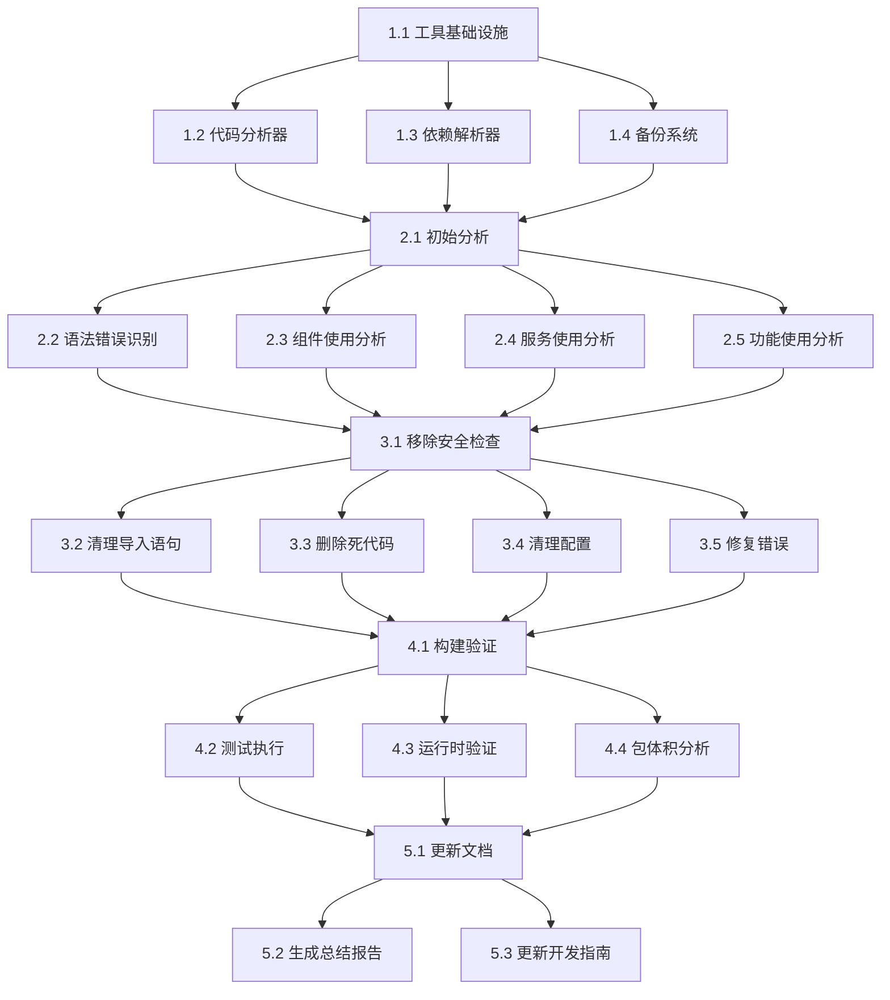

# Code Cleanup and Maintenance Task Decomposition

## Task Overview

This document decomposes the code cleanup and maintenance work into specific, actionable tasks. The process involves systematic analysis, identification, removal, and validation of dead code, unused features, and syntax errors to improve code quality and maintainability.

## Phase 1: Preparation and Setup

### Task 1.1: Create Cleanup Tools Infrastructure
- **Files**: `src/utils/codeCleanup/`, `src/utils/codeCleanup/types.ts`
- **Description**: Set up the basic infrastructure for code cleanup tools
- **Acceptance Criteria**:
  - Create codeCleanup utility directory structure
  - Define TypeScript interfaces for cleanup operations
  - Set up error handling and logging utilities
  - Create basic configuration files
- **Priority**: High
- **Estimated Time**: 2 hours

### Task 1.2: Implement CodeAnalyzer Tool
- **Files**: `src/utils/codeCleanup/CodeAnalyzer.ts`, `src/utils/codeCleanup/CodeAnalyzer.test.ts`
- **Description**: Develop the core code analysis tool
- **Acceptance Criteria**:
  - Implement file scanning functionality
  - Add syntax error detection
  - Create unused import identification
  - Develop dead code detection algorithms
  - Write comprehensive unit tests
- **Priority**: High
- **Estimated Time**: 4 hours

### Task 1.3: Implement DependencyResolver Tool
- **Files**: `src/utils/codeCleanup/DependencyResolver.ts`, `src/utils/codeCleanup/DependencyResolver.test.ts`
- **Description**: Create dependency analysis and resolution tool
- **Acceptance Criteria**:
  - Implement dependency graph construction
  - Add circular dependency detection
  - Create unused module identification
  - Develop import validation
  - Write unit tests and integration tests
- **Priority**: High
- **Estimated Time**: 3.5 hours

### Task 1.4: Set Up Backup and Recovery System
- **Files**: `src/utils/codeCleanup/BackupManager.ts`, `src/utils/codeCleanup/RollbackManager.ts`
- **Description**: Implement backup and recovery mechanisms for safe cleanup
- **Acceptance Criteria**:
  - Create file backup functionality
  - Implement rollback mechanisms
  - Add backup validation
  - Develop recovery procedures
  - Test backup and restore operations
- **Priority**: High
- **Estimated Time**: 2.5 hours

## Phase 2: Analysis and Identification

### Task 2.1: Perform Initial Codebase Analysis
- **Files**: Generated analysis reports in `reports/cleanup/`
- **Description**: Run comprehensive analysis on the entire codebase
- **Acceptance Criteria**:
  - Scan all TypeScript/JavaScript files
  - Analyze all React components
  - Check all service files
  - Identify all configuration files
  - Generate detailed analysis report
- **Priority**: High
- **Estimated Time**: 3 hours

### Task 2.2: Identify Syntax and Type Errors
- **Files**: `reports/cleanup/syntax-errors.json`, `reports/cleanup/type-errors.json`
- **Description**: Detect and catalog all syntax and type errors
- **Acceptance Criteria**:
  - Run TypeScript compiler with strict mode
  - Execute ESLint with all rules enabled
  - Identify missing type annotations
  - Detect incorrect import statements
  - Generate error classification report
- **Priority**: High
- **Estimated Time**: 2 hours

### Task 2.3: Analyze Component Usage
- **Files**: `reports/cleanup/component-usage.json`, `reports/cleanup/unused-components.json`
- **Description**: Analyze React component usage patterns
- **Acceptance Criteria**:
  - Map all component imports and exports
  - Identify components not rendered anywhere
  - Find unused component props
  - Detect orphaned component files
  - Create component dependency graph
- **Priority**: High
- **Estimated Time**: 2.5 hours

### Task 2.4: Analyze Service and Utility Usage
- **Files**: `reports/cleanup/service-usage.json`, `reports/cleanup/utility-usage.json`
- **Description**: Analyze service and utility function usage
- **Acceptance Criteria**:
  - Map all service method calls
  - Identify unused service methods
  - Find unused utility functions
  - Detect unused constants and enums
  - Create usage statistics report
- **Priority**: Medium
- **Estimated Time**: 2 hours

### Task 2.5: Identify Unused Features and Routes
- **Files**: `reports/cleanup/unused-features.json`, `reports/cleanup/route-analysis.json`
- **Description**: Identify unused features and broken routes
- **Acceptance Criteria**:
  - Analyze route definitions
  - Check navigation links
  - Identify unused pages
  - Find disabled feature flags
  - Create feature usage report
- **Priority**: Medium
- **Estimated Time**: 2 hours

## Phase 3: Safe Removal and Cleanup

### Task 3.1: Create Removal Safety Checklist
- **Files**: `reports/cleanup/removal-checklist.md`, `src/utils/codeCleanup/SafetyChecker.ts`
- **Description**: Develop safety validation for code removal
- **Acceptance Criteria**:
  - Define removal safety criteria
  - Create validation checklist
  - Implement safety verification functions
  - Add risk assessment algorithms
  - Test safety validation logic
- **Priority**: High
- **Estimated Time**: 2 hours

### Task 3.2: Remove Unused Import Statements
- **Files**: Affected files throughout codebase, `reports/cleanup/import-cleanup.log`
- **Description**: Clean up unused import statements
- **Acceptance Criteria**:
  - Identify all unused imports
  - Remove unused import statements
  - Update import organization
  - Maintain proper import order
  - Validate import correctness after removal
- **Priority**: Medium
- **Estimated Time**: 3 hours

### Task 3.3: Remove Dead Code Files
- **Files**: Files to be removed, `reports/cleanup/removed-files.log`
- **Description**: Safely remove identified dead code files
- **Acceptance Criteria**:
  - Backup files before removal
  - Remove unused component files
  - Delete unused utility files
  - Clean up unused type definitions
  - Update file removal log
- **Priority**: High
- **Estimated Time**: 2.5 hours

### Task 3.4: Clean Up Configuration Files
- **Files**: Various config files, `reports/cleanup/config-cleanup.log`
- **Description**: Clean up and optimize configuration files
- **Acceptance Criteria**:
  - Remove unused configuration entries
  - Update import paths in configs
  - Clean up build configurations
  - Optimize webpack/linter configs
  - Validate configuration correctness
- **Priority**: Medium
- **Estimated Time**: 2 hours

### Task 3.5: Fix Syntax and Type Errors
- **Files**: Affected files throughout codebase, `reports/cleanup/error-fixes.log`
- **Description**: Fix identified syntax and type errors
- **Acceptance Criteria**:
  - Fix TypeScript compilation errors
  - Correct ESLint violations
  - Add missing type annotations
  - Fix incorrect import statements
  - Validate all fixes
- **Priority**: High
- **Estimated Time**: 4 hours

## Phase 4: Validation and Testing

### Task 4.1: Run Build Validation
- **Files**: Build outputs, `reports/cleanup/build-validation.json`
- **Description**: Validate that cleaned code builds successfully
- **Acceptance Criteria**:
  - Run production build
  - Check for build errors
  - Validate bundle size
  - Test build performance
  - Generate build report
- **Priority**: High
- **Estimated Time**: 1.5 hours

### Task 4.2: Execute Test Suite
- **Files**: Test outputs, `reports/cleanup/test-results.json`
- **Description**: Run all tests to ensure functionality is preserved
- **Acceptance Criteria**:
  - Run unit tests
  - Execute integration tests
  - Run E2E tests
  - Check test coverage
  - Identify any broken tests
- **Priority**: High
- **Estimated Time**: 2 hours

### Task 4.3: Perform Runtime Validation
- **Files**: Runtime logs, `reports/cleanup/runtime-validation.json`
- **Description**: Validate application runtime behavior
- **Acceptance Criteria**:
  - Start development server
  - Test all user workflows
  - Verify API integrations
  - Check console errors
  - Validate performance metrics
- **Priority**: High
- **Estimated Time**: 2 hours

### Task 4.4: Analyze Bundle Size Impact
- **Files**: Bundle analysis, `reports/cleanup/bundle-analysis.json`
- **Description**: Analyze the impact of cleanup on bundle size
- **Acceptance Criteria**:
  - Compare before/after bundle sizes
  - Analyze chunk size changes
  - Identify size reduction benefits
  - Check for any size increases
  - Generate optimization recommendations
- **Priority**: Medium
- **Estimated Time**: 1.5 hours

## Phase 5: Documentation and Finalization

### Task 5.1: Update Code Comments and Documentation
- **Files**: Affected files, updated README files
- **Description**: Update comments and documentation to reflect changes
- **Acceptance Criteria**:
  - Update JSDoc comments
  - Fix outdated documentation
  - Update README files
  - Clean up code comments
  - Validate documentation accuracy
- **Priority**: Medium
- **Estimated Time**: 2.5 hours

### Task 5.2: Generate Cleanup Summary Report
- **Files**: `reports/cleanup/final-report.md`, `reports/cleanup/cleanup-summary.json`
- **Description**: Create comprehensive cleanup summary
- **Acceptance Criteria**:
  - Summarize all changes made
  - Document benefits achieved
  - List any issues encountered
  - Provide recommendations for future
  - Generate executive summary
- **Priority**: Medium
- **Estimated Time**: 2 hours

### Task 5.3: Update Development Guidelines
- **Files**: `docs/CONTRIBUTING.md`, `docs/CODE_STYLE.md`
- **Description**: Update development guidelines based on cleanup findings
- **Acceptance Criteria**:
  - Update coding standards
  - Add cleanup best practices
  - Document maintenance procedures
  - Update code review guidelines
  - Create cleanup checklist for future
- **Priority**: Low
- **Estimated Time**: 1.5 hours

## Task Dependencies

## Task Priority Explanation

- **High Priority**: Core functionality, build-breaking issues, safety-critical tasks
- **Medium Priority**: Quality improvements, documentation updates, optimization tasks
- **Low Priority**: Nice-to-have improvements, future planning tasks

## Acceptance Criteria Summary

### Code Quality Metrics
- Zero TypeScript compilation errors
- Zero ESLint errors and warnings
- All tests passing (unit, integration, E2E)
- Build completes successfully
- Bundle size optimized

### Safety Metrics
- All changes backed up before execution
- Rollback capability available
- No functionality broken
- User workflows preserved
- API integrations maintained

### Documentation Metrics
- All code properly documented
- README files updated
- API documentation current
- Development guidelines updated

## Risk Assessment

### High Risk Tasks
- File removal operations (Task 3.3)
- Configuration file changes (Task 3.4)
- Mass import statement cleanup (Task 3.2)

### Mitigation Strategies
- Comprehensive backup system
- Incremental changes with validation
- Automated rollback capability
- Extensive testing before/after changes

## Success Metrics

### Quantitative Metrics
- Lines of code removed: Target > 10%
- Bundle size reduction: Target > 5%
- Build time improvement: Target > 10%
- Test execution time: Target < 5% increase

### Qualitative Metrics
- Code readability improved
- Import statements cleaner
- File structure more logical
- Developer experience enhanced
- Maintenance burden reduced

## Timeline and Milestones

### Week 1: Foundation (Tasks 1.1-1.4)
- Set up cleanup infrastructure
- Develop core analysis tools
- Implement safety mechanisms

### Week 2: Analysis (Tasks 2.1-2.5)
- Perform comprehensive codebase analysis
- Identify all issues and dead code
- Generate detailed reports

### Week 3: Cleanup (Tasks 3.1-3.5)
- Execute safe removal operations
- Fix syntax and type errors
- Clean up imports and configurations

### Week 4: Validation (Tasks 4.1-4.4)
- Validate build and runtime behavior
- Execute complete test suite
- Analyze performance impact

### Week 5: Documentation (Tasks 5.1-5.3)
- Update all documentation
- Generate final reports
- Update development guidelines

Total Estimated Time: 45 hours across 5 weeks

