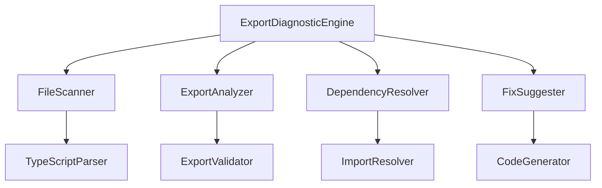

# Design Document

## Overview

导出错误诊断系统是一个专门的工具，用于自动检测和分析TypeScript/JavaScript模块导出问题，特别是针对RAGMessage接口导出错误。该系统通过静态代码分析、依赖关系检查和智能修复建议，帮助开发者快速定位和解决导出相关的问题。

## Steering Document Alignment

### Technical Standards (tech.md)
- 遵循项目中已有的TypeScript类型定义规范
- 使用项目标准的错误处理模式
- 采用项目统一的日志记录机制
- 遵循项目组件设计模式和接口定义规范

### Project Structure (structure.md)
- 诊断工具将放置在`src/utils/`目录下
- 遵循项目的模块化组织结构
- 使用项目的统一导出模式
- 遵循项目组件和服务分离的原则

## Code Reuse Analysis

### Existing Components to Leverage
- **Error Handling Service**: 复用现有的错误处理和日志记录机制
- **Type System**: 利用现有的TypeScript类型定义和接口规范
- **File System Utils**: 复用项目中的文件操作工具
- **Configuration Management**: 使用项目的配置管理系统

### Integration Points
- **TypeScript Compiler API**: 集成TypeScript编译器进行代码分析
- **ESLint**: 与现有的代码质量检查工具集成
- **Build System**: 在构建过程中集成诊断检查
- **Development Tools**: 提供命令行和IDE集成的使用方式

## Architecture

诊断系统采用模块化设计，将功能分解为独立的、可复用的组件。

### Modular Design Principles
- **Single File Responsibility**: 每个模块专注于特定的诊断功能
- **Component Isolation**: 创建专门的诊断引擎和报告生成器
- **Service Layer Separation**: 分离代码分析、问题检测和修复建议生成
- **Utility Modularity**: 将通用的代码解析和文件操作功能抽象为独立工具



## Components and Interfaces

### ExportDiagnosticEngine (核心诊断引擎)
- **Purpose:** 协调整个诊断流程，整合各个组件的功能
- **Interfaces:** 
  - `diagnose(): DiagnosticResult[]`
  - `validateFix(fix: FixSuggestion): ValidationResult`
  - `generateReport(): DiagnosticReport`
- **Dependencies:** FileScanner, ExportAnalyzer, DependencyResolver, FixSuggester
- **Reuses:** 项目现有的异步处理模式和错误处理机制

### FileScanner (文件扫描器)
- **Purpose:** 扫描项目中的TypeScript/JavaScript文件，收集导出声明
- **Interfaces:**
  - `scanFiles(patterns: string[]): FileInfo[]`
  - `parseExports(file: FileInfo): ExportInfo[]`
- **Dependencies:** TypeScript Compiler API, File System APIs
- **Reuses:** 项目中的文件系统工具

### ExportAnalyzer (导出分析器)
- **Purpose:** 分析导出声明的一致性和完整性
- **Interfaces:**
  - `analyzeExports(exports: ExportInfo[]): ExportIssue[]`
  - `validateExportConsistency(): ConsistencyResult`
- **Dependencies:** TypeScript AST Parser
- **Reuses:** 项目中的类型检查工具

### DependencyResolver (依赖解析器)
- **Purpose:** 解析模块间的依赖关系，识别缺失的导出
- **Interfaces:**
  - `resolveDependencies(file: FileInfo): DependencyGraph`
  - `findMissingImports(): MissingImport[]`
- **Dependencies:** TypeScript Compiler API
- **Reuses:** 项目中的模块解析逻辑

### FixSuggester (修复建议器)
- **Purpose:** 基于诊断结果生成具体的修复建议
- **Interfaces:**
  - `suggestFixes(issues: ExportIssue[]): FixSuggestion[]`
  - `generateCodeFix(fix: FixSuggestion): CodeSnippet`
- **Dependencies:** Code Generator, Template Engine
- **Reuses:** 项目中的代码生成工具

## Data Models

### ExportInfo (导出信息)
```typescript
interface ExportInfo {
  filePath: string;
  exportName: string;
  exportType: 'named' | 'default' | 'namespace';
  isTypeOnly: boolean;
  sourceLocation: {
    line: number;
    column: number;
  };
  references: ReferenceInfo[];
}
```

### ExportIssue (导出问题)
```typescript
interface ExportIssue {
  id: string;
  type: 'missing' | 'inconsistent' | 'unused' | 'circular';
  severity: 'high' | 'medium' | 'low';
  filePath: string;
  exportName: string;
  description: string;
  suggestedFix: FixSuggestion;
  relatedFiles: string[];
}
```

### FixSuggestion (修复建议)
```typescript
interface FixSuggestion {
  type: 'add-export' | 'remove-export' | 'fix-import' | 'create-interface';
  filePath: string;
  codeSnippet: string;
  description: string;
  confidence: number;
  requiresUserConfirmation: boolean;
}
```

### DiagnosticReport (诊断报告)
```typescript
interface DiagnosticReport {
  timestamp: Date;
  scannedFiles: number;
  totalIssues: number;
  issuesBySeverity: Record<string, number>;
  issuesByType: Record<string, number>;
  suggestedFixes: FixSuggestion[];
  executionTime: number;
}
```

## Error Handling

### Error Scenarios

1. **文件解析失败**
   - **Handling:** 记录错误并继续处理其他文件，提供降级诊断
   - **User Impact:** 显示警告信息，不影响整体诊断过程

2. **TypeScript编译错误**
   - **Handling:** 捕获编译错误，转换为诊断问题
   - **User Impact:** 显示编译错误信息和修复建议

3. **权限访问问题**
   - **Handling:** 检查文件访问权限，提供明确的错误提示
   - **User Impact:** 显示无法访问的文件列表和解决方案

4. **内存不足**
   - **Handling:** 实现增量处理，避免一次性加载所有文件
   - **User Impact:** 分批处理文件，显示处理进度

## Testing Strategy

### Unit Testing
- 测试各个组件的核心功能
- 使用mock数据验证错误检测逻辑
- 测试边界情况和异常处理

### Integration Testing
- 测试组件间的协作流程
- 验证完整的诊断和修复流程
- 测试与现有系统的集成

### End-to-End Testing
- 在实际项目中运行诊断
- 验证修复建议的准确性
- 测试命令行和IDE集成功能