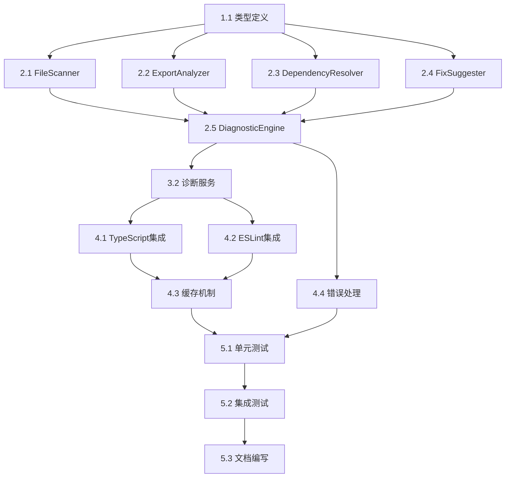

# 导出错误诊断系统任务分解

## 任务概述

本文档将导出错误诊断系统的开发工作分解为具体的实施任务，按照优先级和依赖关系进行组织，确保开发工作的有序进行。

## 阶段1：基础架构搭建

### 任务1.1：创建类型定义和接口
- **文件**: src/types/exportDiagnostic.ts
- **描述**: 定义导出诊断系统相关的TypeScript类型和接口
- **验收标准**:
  - ExportInfo, ExportIssue, FixSuggestion, DiagnosticReport接口定义完成
  - 错误类型和严重程度枚举定义
  - 文件位置和引用信息结构定义
- **优先级**: 高
- **预估时间**: 2小时

### 任务1.2：创建基础工具类
- **文件**: src/utils/exportDiagnosticUtils.ts
- **描述**: 创建诊断系统的基础工具函数
- **验收标准**:
  - 文件路径解析工具
  - 导出声明解析工具
  - 错误分类和优先级判断工具
- **优先级**: 高
- **预估时间**: 1.5小时

### 任务1.3：创建配置管理
- **文件**: src/config/exportDiagnosticConfig.ts
- **描述**: 定义诊断系统的配置选项
- **验收标准**:
  - 扫描文件类型配置
  - 忽略文件模式配置
  - 诊断规则配置
- **优先级**: 中
- **预估时间**: 1小时

## 阶段2：核心组件开发

### 任务2.1：实现FileScanner组件
- **文件**: src/utils/diagnostic/FileScanner.ts
- **描述**: 实现文件扫描和导出声明收集功能
- **验收标准**:
  - 支持TypeScript和JavaScript文件扫描
  - 导出声明解析功能
  - 文件过滤和忽略功能
  - 增量扫描支持
- **优先级**: 高
- **预估时间**: 3小时

### 任务2.2：实现ExportAnalyzer组件
- **文件**: src/utils/diagnostic/ExportAnalyzer.ts
- **描述**: 实现导出声明一致性和完整性分析
- **验收标准**:
  - 导出一致性检查
  - 缺失导出检测
  - 循环依赖检测
  - 类型导出验证
- **优先级**: 高
- **预估时间**: 3.5小时

### 任务2.3：实现DependencyResolver组件
- **文件**: src/utils/diagnostic/DependencyResolver.ts
- **描述**: 实现模块间依赖关系解析
- **验收标准**:
  - 导入语句解析
  - 依赖图构建
  - 缺失导入检测
  - 循环引用识别
- **优先级**: 高
- **预估时间**: 3小时

### 任务2.4：实现FixSuggester组件
- **文件**: src/utils/diagnostic/FixSuggester.ts
- **描述**: 实现智能修复建议生成
- **验收标准**:
  - 修复建议生成算法
  - 代码片段生成
  - 置信度评估
  - 多方案建议
- **优先级**: 高
- **预估时间**: 4小时

### 任务2.5：实现ExportDiagnosticEngine核心引擎
- **文件**: src/utils/diagnostic/ExportDiagnosticEngine.ts
- **描述**: 实现诊断流程协调和结果整合
- **验收标准**:
  - 诊断流程编排
  - 组件间数据流
  - 结果聚合和排序
  - 性能监控和优化
- **优先级**: 高
- **预估时间**: 3.5小时

## 阶段3：服务层集成

### 任务3.1：创建诊断服务接口
- **文件**: src/services/IDiagnosticService.ts
- **描述**: 定义诊断服务的接口契约
- **验收标准**:
  - 服务方法签名定义
  - 返回类型规范
  - 错误处理接口
- **优先级**: 中
- **预估时间**: 1小时

### 任务3.2：实现诊断服务
- **文件**: src/services/DiagnosticService.ts
- **描述**: 实现完整的诊断服务
- **验收标准**:
  - 与诊断引擎集成
  - 错误处理和日志记录
  - 配置管理和缓存
  - 异步操作支持
- **优先级**: 中
- **预估时间**: 2.5小时

### 任务3.3：创建诊断命令行工具
- **文件**: src/cli/diagnostic.ts
- **描述**: 创建命令行诊断工具
- **验收标准**:
  - 命令行参数解析
  - 输出格式化
  - 配置文件支持
  - 帮助文档
- **优先级**: 中
- **预估时间**: 2小时

## 阶段4：集成和优化

### 任务4.1：集成TypeScript编译器API
- **文件**: src/utils/diagnostic/TypeScriptIntegration.ts
- **描述**: 集成TypeScript编译器进行代码分析
- **验收标准**:
  - AST解析集成
  - 类型检查集成
  - 编译错误处理
  - 性能优化
- **优先级**: 高
- **预估时间**: 3小时

### 任务4.2：集成ESLint工具
- **文件**: src/utils/diagnostic/ESLintIntegration.ts
- **描述**: 与ESLint集成提供代码质量检查
- **验收标准**:
  - ESLint规则集成
  - 自定义规则开发
  - 配置同步
  - 结果合并
- **优先级**: 中
- **预估时间**: 2.5小时

### 任务4.3：实现缓存机制
- **文件**: src/utils/diagnostic/CacheManager.ts
- **描述**: 实现诊断结果缓存提高性能
- **验收标准**:
  - 文件变更检测
  - 增量诊断支持
  - 缓存失效策略
  - 内存管理
- **优先级**: 中
- **预估时间**: 2小时

### 任务4.4：添加错误处理和日志记录
- **文件**: src/utils/diagnostic/ErrorHandler.ts
- **描述**: 完善错误处理和日志记录机制
- **验收标准**:
  - 优雅的错误处理
  - 详细的日志记录
  - 错误分类和报告
  - 恢复机制
- **优先级**: 高
- **预估时间**: 2小时

## 阶段5：测试和文档

### 任务5.1：编写单元测试
- **文件**:
  - src/__tests__/utils/diagnostic/FileScanner.test.ts
  - src/__tests__/utils/diagnostic/ExportAnalyzer.test.ts
  - src/__tests__/utils/diagnostic/DependencyResolver.test.ts
  - src/__tests__/utils/diagnostic/FixSuggester.test.ts
  - src/__tests__/services/DiagnosticService.test.ts
- **描述**: 为核心组件和服务编写单元测试
- **验收标准**:
  - 组件功能测试
  - 边界情况测试
  - 错误场景测试
  - 测试覆盖率 > 80%
- **优先级**: 中
- **预估时间**: 8小时

### 任务5.2：编写集成测试
- **文件**: src/__tests__/integration/export-diagnostic.test.ts
- **描述**: 编写端到端集成测试
- **验收标准**:
  - 完整诊断流程测试
  - 实际项目文件测试
  - 修复建议验证测试
  - 性能基准测试
- **优先级**: 中
- **预估时间**: 4小时

### 任务5.3：编写使用文档和示例
- **文件**:
  - docs/EXPORT_DIAGNOSTIC.md
  - examples/export-diagnostic-usage.ts
- **描述**: 创建使用文档和示例代码
- **验收标准**:
  - 详细的使用说明
  - 配置选项文档
  - 常见问题解答
  - 最佳实践指南
- **优先级**: 低
- **预估时间**: 3小时

## 任务依赖关系

## 任务优先级说明

- **高优先级**: 核心功能实现，影响系统基本可用性
- **中优先级**: 增强功能和集成，提高系统完整性
- **低优先级**: 文档和优化，在核心功能完成后进行

## 验收标准

每个任务完成后需要满足以下条件：
1. 代码通过TypeScript编译检查
2. 单元测试覆盖率达到80%以上
3. 代码遵循项目编码规范
4. 相关文档及时更新
5. 与现有系统正确集成

## 风险识别

1. **TypeScript版本兼容性**: 需要测试不同TypeScript版本的兼容性
2. **大型项目性能**: 需要优化大项目文件的扫描性能
3. **复杂依赖关系**: 需要处理复杂的模块依赖解析
4. **错误误报**: 需要精确的诊断算法减少误报

## 里程碑

- **里程碑1**: 完成基础架构搭建 (任务1.1-1.3)
- **里程碑2**: 完成核心组件开发 (任务2.1-2.5)
- **里程碑3**: 完成服务层集成 (任务3.1-3.3)
- **里程碑4**: 完成集成和优化 (任务4.1-4.4)
- **里程碑5**: 完成测试和文档 (任务5.1-5.3)