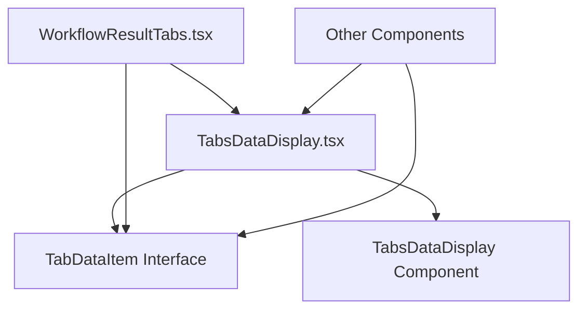

# Design Document

## Overview

本设计文档旨在系统性地修复 `TabDataItem` 接口无法从 `TabsDataDisplay.tsx` 正确导出的问题，以及识别和修复所有可能的横向同类错误。该修复将确保 React 组件和 TypeScript 接口的正确导出和导入，提高代码的可维护性和可靠性。

## Steering Document Alignment

### Technical Standards (tech.md)
由于项目没有技术标准文档，我们将遵循 React + TypeScript 的最佳实践：
- 使用 ES6 模块导出/导入语法
- 遵循 TypeScript 接口和类型定义规范
- 保持组件和接口的清晰分离

### Project Structure (structure.md)
由于项目没有结构文档，我们将遵循现有的项目结构：
- 组件位于 `src/components/` 目录下
- 接口和类型定义与组件在同一文件中或单独的类型文件中
- 使用相对路径进行模块导入

## Code Reuse Analysis

### Existing Components to Leverage
- **TabsDataDisplay.tsx**: 现有的标签数据显示组件，需要确保其接口正确导出
- **WorkflowResultTabs.tsx**: 使用 TabsDataDisplay 组件的工作流结果标签组件
- **InformationDashboard**: 信息仪表板相关组件目录

### Integration Points
- **React 组件系统**: 确保组件间的正确导入导出
- **TypeScript 类型系统**: 确保接口和类型的正确声明和导出
- **Vite 构建系统**: 确保模块解析正确工作

## Architecture

本修复采用系统性的方法来解决导出错误问题：

### Modular Design Principles
- **Single File Responsibility**: 每个文件负责特定的组件或接口定义
- **Component Isolation**: 组件和接口保持清晰的边界和导出声明
- **Service Layer Separation**: 区分组件逻辑、接口定义和类型声明
- **Utility Modularity**: 确保工具函数和类型定义的正确模块化



## Components and Interfaces

### TabsDataDisplay Component
- **Purpose:** 提供标签数据显示功能的 React 组件
- **Interfaces:** 导出 TabsDataDisplay 组件和 TabDataItem 接口
- **Dependencies:** React, Ant Design
- **Reuses:** 现有的 Ant Design Tabs 组件

### TabDataItem Interface
- **Purpose:** 定义标签数据项的 TypeScript 接口
- **Interfaces:** 包含 key, label, icon, content, closable 属性
- **Dependencies:** 无
- **Reuses:** 标准 TypeScript 接口定义

### WorkflowResultTabs Component
- **Purpose:** 工作流结果的标签显示组件
- **Interfaces:** 使用 TabsDataDisplay 组件和 TabDataItem 接口
- **Dependencies:** TabsDataDisplay, React
- **Reuses:** TabsDataDisplay 组件和相关接口

## Data Models

### TabDataItem Interface
```typescript
interface TabDataItem {
  key: string;           // 唯一标识符
  label: string;         // 标签显示文本
  icon?: React.ReactNode; // 可选图标
  content: React.ReactNode; // 标签内容
  closable?: boolean;    // 是否可关闭
}
```

### TabsDataDisplayProps Interface
```typescript
interface TabsDataDisplayProps {
  items: TabDataItem[];  // 标签数据项数组
  activeKey?: string;    // 当前激活的标签
  onTabChange?: (key: string) => void; // 标签切换回调
  onTabClose?: (key: string) => void;  // 标签关闭回调
}
```

## Error Handling

### Error Scenarios
1. **导出声明缺失:** 接口或组件没有正确的 export 声明
   - **Handling:** 添加正确的 export 声明
   - **User Impact:** 编译错误，模块无法导入

2. **导入路径错误:** 组件导入了错误的模块路径
   - **Handling:** 修正导入路径为正确的相对路径
   - **User Impact:** 运行时错误，组件无法加载

3. **类型定义不匹配:** 接口定义与实际使用不匹配
   - **Handling:** 统一接口定义和使用方式
   - **User Impact:** TypeScript 编译错误

4. **循环依赖:** 组件间存在循环导入依赖
   - **Handling:** 重构组件结构，消除循环依赖
   - **User Impact:** 构建错误或运行时错误

## Testing Strategy

### Unit Testing
- 测试每个组件的导出是否正确
- 测试接口定义是否完整和正确
- 测试组件的基本渲染功能

### Integration Testing
- 测试组件间的导入导出是否正常工作
- 测试 TypeScript 类型检查是否通过
- 测试 Vite 构建过程是否成功

### End-to-End Testing
- 测试信息仪表板的完整功能
- 测试标签组件的交互功能
- 测试页面刷新后的数据持久化功能