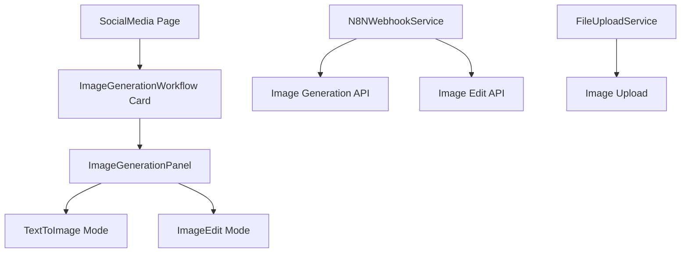

# 图像生成工作流设计文档

## 概述

图像生成工作流是一个集成在 Social Media 页面中的 AI 驱动图像处理功能，提供文本到图像生成和图像编辑两种核心能力。通过与 n8n 后台的 webhook 集成，实现与 AI 图像处理服务的无缝对接。

## 与指导文档的一致性

### 技术标准 (tech.md)
- 遵循现有的 React + TypeScript + Ant Design 技术栈
- 使用现有的状态管理模式（Redux Toolkit）
- 遵循现有的服务层架构模式
- 采用现有的错误处理和消息提示机制

### 项目结构 (structure.md)
- 遵循现有的页面组件组织结构：pages/{PageName}/components/
- 复用现有的服务层架构：services/
- 遵循现有的类型定义组织：types/
- 集成到现有的路由和导航结构

## 代码复用分析

### 现有组件复用
- **WorkflowCard**: 复用现有的工作流卡片组件用于工作流选择
- **WorkflowSidebar**: 复用现有的侧边栏布局结构
- **N8NWebhookService**: 复用现有的 webhook 服务进行 API 调用
- **消息提示系统**: 复用现有的 useMessage hook
- **错误处理**: 复用现有的错误处理机制

### 集成点
- **Social Media 页面**: 集成到现有的 SocialMedia.tsx 主页面
- **状态管理**: 集成到现有的 Redux store 结构
- **路由系统**: 集成到现有的路由配置
- **类型系统**: 扩展现有的类型定义

## 架构

### 模块化设计原则
- **单一文件职责**: 每个组件和工具类都有明确的单一功能
- **组件隔离**: 工作流卡片、面板组件、服务层相互独立
- **服务层分离**: webhook 通信、业务逻辑、UI 展示分离
- **工具模块化**: 图像处理、文件上传等功能模块化



## 组件和接口

### ImageGenerationWorkflowCard 组件
- **目的**: 在 WorkflowSidebar 中显示图像生成工作流选项
- **接口**:
  - `onWorkflowSelect(workflow: Workflow): void`
  - `onSettings(workflowId: string): void`
- **依赖**: WorkflowCard, Workflow 类型
- **复用**: 现有的 WorkflowCard 组件结构

### ImageGenerationPanel 组件
- **目的**: 提供图像生成的完整用户界面
- **接口**:
  - `workflow: Workflow` - 当前选择的工作流
  - `loading?: boolean` - 加载状态
  - `onImageGenerated?(imageUrl: string): void` - 图像生成回调
- **依赖**: Ant Design 组件, FileUpload 组件
- **复用**: 现有的面板布局模式

### TextToImageTab 组件
- **目的**: 处理文本到图像生成功能
- **接口**:
  - `onSubmit(prompt: string): Promise<void>`
  - `loading?: boolean`
  - `generatedImage?: string`
- **依赖**: TextArea, Button, Image 组件
- **复用**: 现有的表单组件模式

### ImageEditTab 组件
- **目的**: 处理图像编辑功能
- **接口**:
  - `onSubmit(imageFile: File, prompt: string): Promise<void>`
  - `loading?: boolean`
  - `editedImage?: string`
- **依赖**: Upload 组件, TextArea, Image 组件
- **复用**: 现有的文件上传组件

## 数据模型

### ImageGenerationRequest 模型
```typescript
interface ImageGenerationRequest {
  id: string;
  type: 'text-to-image' | 'image-edit';
  prompt: string;
  imageFile?: File;
  webhookUrl: string;
  createdAt: string;
  status: 'pending' | 'processing' | 'completed' | 'failed';
}
```

### ImageGenerationResponse 模型
```typescript
interface ImageGenerationResponse {
  id: string;
  requestId: string;
  imageUrl: string;
  prompt?: string;
  processingTime?: number;
  createdAt: string;
  errorMessage?: string;
}
```

### ImageGenerationSettings 模型
```typescript
interface ImageGenerationSettings {
  webhookUrl: string;
  defaultPrompt?: string;
  maxImageSize: number;
  supportedFormats: string[];
  timeout: number;
}
```

## 错误处理

### 错误场景
1. **网络连接错误**:
   - **处理**: 显示网络错误提示，提供重试按钮
   - **用户影响**: 用户看到友好的错误消息，可以重试操作

2. **文件上传错误**:
   - **处理**: 验证文件大小和格式，显示具体错误原因
   - **用户影响**: 用户看到文件要求和错误详情

3. **图像生成超时**:
   - **处理**: 显示进度提示，提供取消选项
   - **用户影响**: 用户了解处理进度，可以选择等待或取消

4. **服务不可用**:
   - **处理**: 显示服务维护提示，提供备用方案
   - **用户影响**: 用户了解当前状态，可以稍后重试

## 测试策略

### 单元测试
- 测试各个组件的渲染和交互逻辑
- 测试服务层的 webhook 调用功能
- 测试文件上传和验证逻辑
- 测试错误处理机制

### 集成测试
- 测试工作流卡片与主页面集成
- 测试面板组件的状态管理
- 测试与 n8n webhook 的完整流程
- 测试错误情况下的用户体验

### 端到端测试
- 测试完整的图像生成流程
- 测试文件上传和图像编辑流程
- 测试在不同网络条件下的表现
- 测试移动端响应式布局