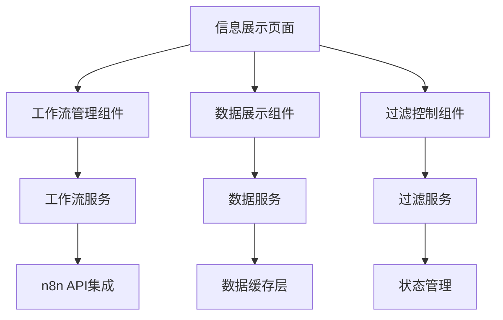

# 信息展示模块设计文档

## 概述

信息展示模块是一个集成n8n工作流系统的数据展示平台，为用户提供统一的信息聚合和展示界面。该模块采用模块化设计，支持多种数据源集成和灵活的工作流配置，为后续功能扩展提供良好的架构基础。

## 指导文档对齐

### 技术标准 (tech.md)
- 遵循React + TypeScript技术栈
- 使用Ant Design组件库保持UI一致性
- 采用Redux进行状态管理
- 遵循现有的代码规范和架构模式

### 项目结构 (structure.md)
- 遵循现有的组件化目录结构
- 在src/pages下创建InformationDashboard目录
- 在src/services下扩展数据服务
- 在src/components下创建可复用组件

## 代码复用分析

### 现有组件复用
- **Layout组件**: 复用现有的页面布局框架
- **Notification组件**: 复用消息通知系统
- **认证系统**: 集成现有的用户认证和权限控制
- **API服务**: 扩展现有的API服务架构

### 集成点
- **Redux Store**: 扩展现有状态管理，添加信息展示相关状态
- **路由系统**: 在现有路由中添加信息展示模块路由
- **主题系统**: 复用现有的主题和样式系统
- **国际化**: 集成现有的i18n系统

## 架构设计

信息展示模块采用分层架构设计，包含展示层、业务逻辑层、数据服务层和外部集成层。

### 模块化设计原则
- **单一职责**: 每个组件专注于特定功能领域
- **组件隔离**: 创建小而专注的组件，避免大型单体组件
- **服务层分离**: 分离数据访问、业务逻辑和展示层
- **工具模块化**: 将工具函数拆分为专注的单一用途模块



## 组件和接口

### InformationDashboard主页面
- **目的**: 信息展示模块的主入口页面
- **接口**: 页面路由、状态管理接口
- **依赖**: Layout组件、认证上下文
- **复用**: 现有的页面布局和认证系统

### WorkflowPanel工作流面板
- **目的**: 管理和触发n8n工作流
- **接口**: 工作流列表、手动触发、参数配置
- **依赖**: 工作流服务、通知组件
- **复用**: 现有的表单组件和通知系统

### DataDisplayGrid数据展示网格
- **目的**: 展示聚合的信息数据
- **接口**: 数据渲染、分页、排序、过滤
- **依赖**: 数据服务、过滤组件
- **复用**: Ant Design的Table和Card组件

### FilterControls过滤控制器
- **目的**: 提供数据过滤和搜索功能
- **接口**: 关键词搜索、时间范围、数据源选择
- **依赖**: 过滤服务、状态管理
- **复用**: 现有的表单控件和日期选择器

### WorkflowConfigModal工作流配置弹窗
- **目的**: 配置工作流参数和触发条件
- **接口**: 参数编辑、验证、保存
- **依赖**: 工作流服务、表单验证
- **复用**: 现有的Modal和Form组件

## 数据模型

### WorkflowConfig工作流配置
```typescript
interface WorkflowConfig {
  id: string;                    // 工作流唯一标识
  name: string;                  // 工作流名称
  description: string;           // 工作流描述
  webhookUrl: string;            // n8n webhook地址
  inputParameters: Parameter[];   // 输入参数配置
  outputFormat: OutputFormat;     // 输出格式定义
  schedule?: ScheduleConfig;      // 定时配置（可选）
  isActive: boolean;             // 是否启用
  createdAt: Date;
  updatedAt: Date;
}
```

### InformationItem信息条目
```typescript
interface InformationItem {
  id: string;                    // 信息唯一标识
  workflowId: string;            // 来源工作流ID
  title: string;                 // 信息标题
  content: string;               // 信息内容
  summary: string;               // 信息摘要
  source: string;                // 数据源（如Reddit、Twitter等）
  keywords: string[];            // 关键词标签
  relevanceScore: number;        // 相关性评分
  createdAt: Date;
  processedAt: Date;
}
```

### FilterCriteria过滤条件
```typescript
interface FilterCriteria {
  keywords: string[];            // 关键词过滤
  dateRange: {
    start: Date;
    end: Date;
  };                            // 时间范围
  sources: string[];            // 数据源过滤
  minRelevanceScore: number;    // 最小相关性评分
  workflowIds: string[];        // 工作流过滤
}
```

## 错误处理

### 错误场景
1. **n8n工作流调用失败**
   - **处理**: 重试机制，记录错误日志，显示用户友好错误信息
   - **用户影响**: 显示"工作流执行失败，请稍后重试"消息

2. **数据加载超时**
   - **处理**: 设置合理超时时间，提供取消操作，缓存部分数据
   - **用户影响**: 显示加载进度，提供取消按钮

3. **参数验证失败**
   - **处理**: 前端表单验证，后端二次验证，详细错误提示
   - **用户影响**: 高亮错误字段，显示具体错误原因

4. **权限不足**
   - **处理**: 检查用户权限，重定向到登录页面或显示权限错误
   - **用户影响**: 显示"权限不足"提示，引导用户联系管理员

## 测试策略

### 单元测试
- 组件渲染测试：验证各组件正确渲染
- 服务函数测试：测试数据处理和API调用逻辑
- 工具函数测试：测试过滤、排序、格式化等工具函数
- 状态管理测试：测试Redux actions和reducers

### 集成测试
- 工作流触发流程：测试从参数输入到结果展示的完整流程
- 数据过滤功能：测试多条件组合过滤的正确性
- 权限控制：测试不同用户角色的访问权限
- API集成：测试与n8n系统的集成接口

### 端到端测试
- 用户工作流：测试用户从登录到使用信息展示功能的完整场景
- 数据展示：测试数据从获取到展示的端到端流程
- 错误处理：测试各种异常情况下的用户体验
- 性能测试：测试大量数据下的页面响应性能