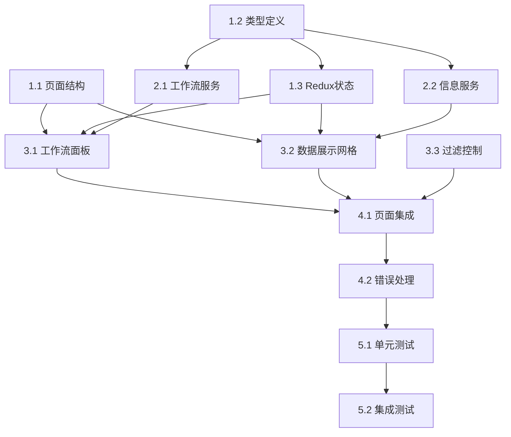

# 信息展示模块任务分解

## 任务概述

本文档将信息展示模块的开发工作分解为具体的实施任务，按照优先级和依赖关系进行组织，确保开发工作的有序进行。

## 阶段1：基础架构搭建

### 任务1.1：创建页面结构
- **描述**: 创建信息展示模块的基础页面结构和路由配置
- **文件**: 
  - `src/pages/InformationDashboard/index.tsx`
  - `src/pages/InformationDashboard/InformationDashboard.tsx`
  - 更新 `src/router/routes.ts`
- **验收标准**: 
  - 页面可通过路由正常访问
  - 集成现有的Layout组件
  - 包含基本的页面标题和导航
- **优先级**: 高
- **预估时间**: 2小时

### 任务1.2：创建数据类型定义
- **描述**: 定义信息展示模块相关的TypeScript类型
- **文件**: 
  - `src/types/workflow.ts`
  - `src/types/information.ts`
- **验收标准**: 
  - 完整的WorkflowConfig接口定义
  - 完整的InformationItem接口定义
  - 完整的FilterCriteria接口定义
- **优先级**: 高
- **预估时间**: 1小时

### 任务1.3：创建Redux状态管理
- **描述**: 为信息展示模块创建Redux slice和相关actions
- **文件**: 
  - `src/store/slices/informationSlice.ts`
  - `src/store/slices/workflowSlice.ts`
  - 更新 `src/store/index.ts`
- **验收标准**: 
  - 工作流状态管理（列表、当前选中、加载状态）
  - 信息数据状态管理（列表、过滤条件、分页）
  - 异步actions用于API调用
- **优先级**: 高
- **预估时间**: 3小时

## 阶段2：服务层开发

### 任务2.1：创建工作流服务
- **描述**: 实现与n8n系统集成的工作流服务
- **文件**: 
  - `src/services/workflowService.ts`
- **验收标准**: 
  - 获取工作流列表API
  - 触发工作流执行API
  - 获取工作流执行状态API
  - 配置工作流参数API
- **优先级**: 高
- **预估时间**: 4小时

### 任务2.2：创建信息数据服务
- **描述**: 实现信息数据的获取和管理服务
- **文件**: 
  - `src/services/informationService.ts`
- **验收标准**: 
  - 获取信息列表API（支持分页和过滤）
  - 获取信息详情API
  - 删除信息API
  - 批量操作API
- **优先级**: 高
- **预估时间**: 3小时

### 任务2.3：创建过滤和搜索服务
- **描述**: 实现数据过滤和搜索功能的服务层
- **文件**: 
  - `src/services/filterService.ts`
- **验收标准**: 
  - 关键词搜索功能
  - 多条件组合过滤
  - 排序功能
  - 缓存机制
- **优先级**: 中
- **预估时间**: 2小时

## 阶段3：核心组件开发

### 任务3.1：开发工作流面板组件
- **描述**: 创建工作流管理和触发的面板组件
- **文件**: 
  - `src/components/InformationDashboard/WorkflowPanel.tsx`
  - `src/components/InformationDashboard/WorkflowCard.tsx`
- **验收标准**: 
  - 显示工作流列表
  - 手动触发工作流按钮
  - 工作流状态指示器
  - 快速配置入口
- **优先级**: 高
- **预估时间**: 4小时

### 任务3.2：开发数据展示网格组件
- **描述**: 创建信息数据的展示网格组件
- **文件**: 
  - `src/components/InformationDashboard/DataDisplayGrid.tsx`
  - `src/components/InformationDashboard/InformationCard.tsx`
- **验收标准**: 
  - 响应式网格布局
  - 信息卡片展示
  - 分页功能
  - 加载状态处理
- **优先级**: 高
- **预估时间**: 5小时

### 任务3.3：开发过滤控制组件
- **描述**: 创建数据过滤和搜索的控制组件
- **文件**: 
  - `src/components/InformationDashboard/FilterControls.tsx`
  - `src/components/InformationDashboard/SearchBar.tsx`
- **验收标准**: 
  - 关键词搜索输入框
  - 时间范围选择器
  - 数据源多选框
  - 相关性评分滑块
- **优先级**: 中
- **预估时间**: 3小时

### 任务3.4：开发工作流配置弹窗
- **描述**: 创建工作流参数配置的弹窗组件
- **文件**: 
  - `src/components/InformationDashboard/WorkflowConfigModal.tsx`
  - `src/components/InformationDashboard/ParameterForm.tsx`
- **验收标准**: 
  - 动态表单生成
  - 参数验证
  - 保存和取消功能
  - 预览功能
- **优先级**: 中
- **预估时间**: 4小时

## 阶段4：页面集成和优化

### 任务4.1：集成主页面组件
- **描述**: 将所有组件集成到主页面中
- **文件**: 
  - 更新 `src/pages/InformationDashboard/InformationDashboard.tsx`
- **验收标准**: 
  - 所有组件正确布局
  - 组件间数据流通畅
  - 响应式设计适配
  - 加载状态统一处理
- **优先级**: 高
- **预估时间**: 3小时

### 任务4.2：实现错误处理机制
- **描述**: 添加全面的错误处理和用户反馈
- **文件**: 
  - `src/utils/errorHandler.ts`
  - 更新相关组件
- **验收标准**: 
  - API调用错误处理
  - 用户友好的错误提示
  - 重试机制
  - 错误日志记录
- **优先级**: 中
- **预估时间**: 2小时

### 任务4.3：性能优化
- **描述**: 优化页面性能和用户体验
- **文件**: 
  - 相关组件文件
- **验收标准**: 
  - 组件懒加载
  - 数据缓存机制
  - 虚拟滚动（如需要）
  - 防抖搜索
- **优先级**: 低
- **预估时间**: 3小时

## 阶段5：测试和文档

### 任务5.1：编写单元测试
- **描述**: 为核心组件和服务编写单元测试
- **文件**: 
  - `src/__tests__/components/InformationDashboard/`
  - `src/__tests__/services/`
- **验收标准**: 
  - 组件渲染测试
  - 服务函数测试
  - 状态管理测试
  - 测试覆盖率 > 80%
- **优先级**: 中
- **预估时间**: 6小时

### 任务5.2：编写集成测试
- **描述**: 编写端到端的集成测试
- **文件**: 
  - `src/__tests__/integration/information-dashboard.test.tsx`
- **验收标准**: 
  - 完整用户流程测试
  - API集成测试
  - 错误场景测试
- **优先级**: 中
- **预估时间**: 4小时

### 任务5.3：编写使用文档
- **描述**: 创建模块使用和维护文档
- **文件**: 
  - `docs/INFORMATION_DASHBOARD.md`
- **验收标准**: 
  - 功能使用说明
  - API接口文档
  - 配置说明
  - 故障排除指南
- **优先级**: 低
- **预估时间**: 2小时

## 任务依赖关系

## 总体时间估算

- **阶段1**: 6小时
- **阶段2**: 9小时
- **阶段3**: 16小时
- **阶段4**: 8小时
- **阶段5**: 12小时

**总计**: 51小时（约6-7个工作日）

## 里程碑

1. **MVP版本** (阶段1-3完成): 基本功能可用
2. **Beta版本** (阶段4完成): 功能完整，可供测试
3. **正式版本** (阶段5完成): 测试完备，可正式发布