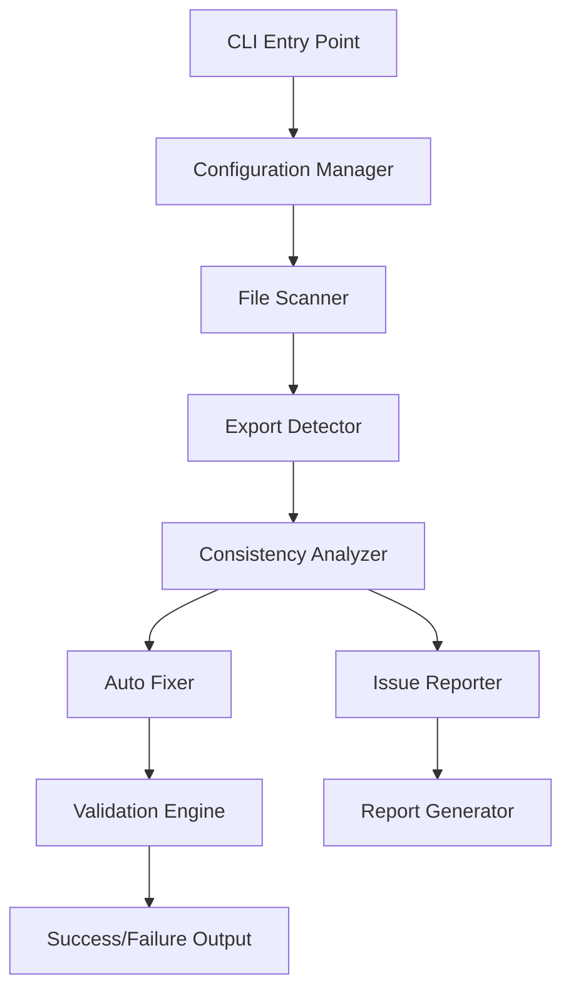

# Design Document

## Overview

本设计文档详细描述了模块导出一致性系统的技术实现方案。该系统旨在解决项目中模块导出不一致导致的导航错误问题，建立标准化的导出模式，并提供自动化检测和修复工具。通过分析现有代码库，我们发现了多种导出模式和潜在的一致性问题，需要建立统一的解决方案。

## Steering Document Alignment

### Technical Standards (tech.md)
由于项目暂无技术标准文档，本设计将遵循 React + TypeScript 最佳实践：
- 使用 ES6 模块导出语法
- 优先使用命名导出，谨慎使用默认导出
- 保持接口和类型的明确导出
- 遵循 TypeScript 严格模式要求

### Project Structure (structure.md)
基于现有项目结构，遵循以下组织原则：
- 组件按功能模块分组（如 `components/InformationDashboard/`）
- 服务层统一管理（`services/`）
- 类型定义集中管理（`types/`）
- 工具函数模块化（`utils/`）

## Code Reuse Analysis

### Existing Components to Leverage
- **TabsDataDisplay**: 已有良好的接口导出模式，可作为标准参考
- **ExportUtils**: 现有导出工具类，可扩展用于模块导出检查
- **ApiService**: 统一的服务导出模式，可复用其结构
- **Common Components**: `src/components/common/index.ts` 展示了良好的批量导出模式

### Integration Points
- **ESLint Configuration**: 集成到现有的 ESLint 规则中
- **Build Process**: 与 Vite 构建流程集成
- **Development Workflow**: 与 lint-staged 和 pre-commit 钩子集成
- **IDE Support**: 与 TypeScript 语言服务集成

## Architecture

本系统采用多层架构设计，包含检测层、分析层、修复层和报告层，确保模块导出的一致性和可维护性。

### Modular Design Principles
- **Single File Responsibility**: 每个检测器负责特定类型的导出问题
- **Component Isolation**: 检测、分析、修复功能独立实现
- **Service Layer Separation**: 分离配置管理、文件操作和报告生成
- **Utility Modularity**: 将通用功能抽取为独立的工具模块



## Components and Interfaces

### Configuration Manager
- **Purpose:** 管理检测规则、修复策略和输出配置
- **Interfaces:** 
  - `loadConfig(path?: string): ExportConfig`
  - `validateConfig(config: ExportConfig): boolean`
  - `getDefaultConfig(): ExportConfig`
- **Dependencies:** 文件系统、JSON解析器
- **Reuses:** 现有的 ESLint 配置加载机制

### File Scanner
- **Purpose:** 扫描项目文件，识别需要检查的模块文件
- **Interfaces:**
  - `scanProject(rootPath: string, options: ScanOptions): FileInfo[]`
  - `filterFiles(files: FileInfo[], patterns: string[]): FileInfo[]`
  - `getFileMetadata(filePath: string): FileMetadata`
- **Dependencies:** 文件系统、glob 模式匹配
- **Reuses:** 现有的项目结构约定

### Export Detector
- **Purpose:** 分析文件中的导出语句，识别导出模式
- **Interfaces:**
  - `detectExports(filePath: string): ExportInfo[]`
  - `parseExportStatement(statement: string): ParsedExport`
  - `validateExportSyntax(exports: ExportInfo[]): ValidationResult`
- **Dependencies:** TypeScript 编译器 API、AST 解析器
- **Reuses:** 现有的 TypeScript 配置

### Consistency Analyzer
- **Purpose:** 分析导出一致性，识别潜在问题
- **Interfaces:**
  - `analyzeConsistency(exports: ExportInfo[]): ConsistencyReport`
  - `checkNamingConventions(exports: ExportInfo[]): NamingIssue[]`
  - `validateImportExportMatching(project: ProjectInfo): MatchingIssue[]`
- **Dependencies:** Export Detector、配置管理器
- **Reuses:** 现有的命名约定和代码风格

### Auto Fixer
- **Purpose:** 自动修复检测到的导出问题
- **Interfaces:**
  - `fixIssues(issues: Issue[], options: FixOptions): FixResult`
  - `generateFixSuggestions(issue: Issue): FixSuggestion[]`
  - `applyFix(fix: FixSuggestion, dryRun: boolean): FixResult`
- **Dependencies:** 文件系统、AST 操作工具
- **Reuses:** 现有的代码格式化工具（Prettier）

### Report Generator
- **Purpose:** 生成详细的检测和修复报告
- **Interfaces:**
  - `generateReport(results: AnalysisResult[], format: ReportFormat): string`
  - `exportReport(report: string, outputPath: string): void`
  - `createSummary(results: AnalysisResult[]): ReportSummary`
- **Dependencies:** 模板引擎、文件系统
- **Reuses:** 现有的 ExportUtils 类结构

## Data Models

### ExportInfo
```typescript
interface ExportInfo {
  filePath: string;
  exportType: 'named' | 'default' | 'namespace' | 'reexport';
  exportName: string;
  exportedType: 'interface' | 'type' | 'class' | 'function' | 'constant' | 'component';
  isTypeOnly: boolean;
  sourceLocation: SourceLocation;
  dependencies: string[];
  documentation?: string;
}
```

### ConsistencyIssue
```typescript
interface ConsistencyIssue {
  id: string;
  type: 'missing-export' | 'naming-inconsistency' | 'circular-dependency' | 'unused-export' | 'import-mismatch';
  severity: 'error' | 'warning' | 'info';
  filePath: string;
  message: string;
  suggestion?: string;
  autoFixable: boolean;
  relatedFiles: string[];
}
```

### FixSuggestion
```typescript
interface FixSuggestion {
  issueId: string;
  description: string;
  changes: FileChange[];
  confidence: number;
  riskLevel: 'low' | 'medium' | 'high';
  previewDiff: string;
}
```

### ProjectAnalysisResult
```typescript
interface ProjectAnalysisResult {
  projectPath: string;
  scanTimestamp: string;
  totalFiles: number;
  analyzedFiles: number;
  issues: ConsistencyIssue[];
  fixedIssues: ConsistencyIssue[];
  summary: {
    errorCount: number;
    warningCount: number;
    fixedCount: number;
    successRate: number;
  };
}
```

## Error Handling

### Error Scenarios
1. **文件访问错误**
   - **Handling:** 捕获文件系统异常，记录错误日志，跳过无法访问的文件
   - **User Impact:** 显示警告信息，继续处理其他文件

2. **TypeScript 解析错误**
   - **Handling:** 使用容错解析器，记录语法错误，提供部分分析结果
   - **User Impact:** 显示语法错误位置，建议修复后重新运行

3. **循环依赖检测**
   - **Handling:** 实现深度优先搜索算法，检测并报告循环依赖链
   - **User Impact:** 提供清晰的依赖路径图，建议重构方案

4. **自动修复失败**
   - **Handling:** 回滚已应用的更改，保存备份文件，生成手动修复指南
   - **User Impact:** 显示失败原因，提供手动修复步骤

5. **配置文件无效**
   - **Handling:** 验证配置文件格式，使用默认配置，显示验证错误
   - **User Impact:** 提供配置文件示例，指出具体错误位置

## Testing Strategy

### Unit Testing
- **Export Detector**: 测试各种导出语法的解析准确性
- **Consistency Analyzer**: 测试问题检测的准确性和完整性
- **Auto Fixer**: 测试修复逻辑的正确性和安全性
- **Configuration Manager**: 测试配置加载和验证逻辑
- **Report Generator**: 测试报告生成的格式和内容

### Integration Testing
- **End-to-End Workflow**: 测试从扫描到修复的完整流程
- **CLI Interface**: 测试命令行参数解析和执行
- **File System Operations**: 测试文件读写和备份恢复
- **TypeScript Integration**: 测试与 TypeScript 编译器的集成
- **Build Process Integration**: 测试与现有构建流程的集成

### End-to-End Testing
- **Real Project Testing**: 在实际项目中测试工具的效果
- **Performance Testing**: 测试大型项目的处理性能
- **Regression Testing**: 确保修复不会引入新问题
- **User Workflow Testing**: 测试开发者的实际使用场景
- **CI/CD Integration**: 测试在持续集成环境中的表现

### Test Data Preparation
- **Sample Projects**: 创建包含各种导出问题的示例项目
- **Edge Cases**: 准备边界情况和异常场景的测试用例
- **Performance Benchmarks**: 建立性能基准测试数据
- **Regression Test Suite**: 维护回归测试用例集合