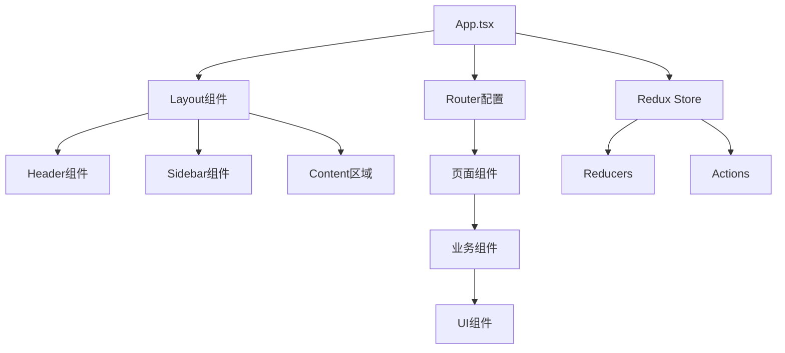

# Design Document

## Overview

项目初始化功能为WendealDashboard建立完整的React + TypeScript开发环境。该设计基于现代前端最佳实践，采用Vite作为构建工具，集成Redux Toolkit进行状态管理，使用Ant Design作为UI组件库，并配置完整的代码质量保证工具链。

## Steering Document Alignment

### Technical Standards (tech.md)
- 采用TypeScript严格模式确保类型安全
- 使用ESLint + Prettier维护代码质量和一致性
- 遵循React 18最新特性和Hooks模式
- 实施模块化架构设计原则

### Project Structure (structure.md)
- 标准化的src目录结构组织
- 清晰的组件、页面、工具函数分层
- 配置文件统一管理
- 测试文件与源码并行组织

## Code Reuse Analysis

### Existing Components to Leverage
- **Vite基础模板**: 利用官方React-TS模板作为起点
- **TypeScript配置**: 扩展标准tsconfig配置
- **ESLint规则**: 基于React推荐规则进行定制

### Integration Points
- **包管理器**: 使用npm进行依赖管理
- **构建系统**: Vite提供开发和生产构建
- **类型系统**: TypeScript编译器集成
- **代码质量**: ESLint/Prettier工具链集成

## Architecture

项目采用分层架构模式，确保关注点分离和代码可维护性：

### Modular Design Principles
- **Single File Responsibility**: 每个文件专注单一功能领域
- **Component Isolation**: 创建小而专注的组件而非大型单体文件
- **Service Layer Separation**: 分离数据访问、业务逻辑和展示层
- **Utility Modularity**: 将工具函数拆分为专注的单一用途模块



## Components and Interfaces

### App组件
- **Purpose:** 应用程序根组件，提供全局上下文
- **Interfaces:** 无公共接口，作为应用入口点
- **Dependencies:** React Router, Redux Provider, Ant Design ConfigProvider
- **Reuses:** Vite默认App组件结构

### Layout组件
- **Purpose:** 应用程序布局框架，提供统一的页面结构
- **Interfaces:** children prop接收页面内容
- **Dependencies:** Ant Design Layout组件
- **Reuses:** Ant Design的Layout、Header、Sider、Content组件

### Router配置
- **Purpose:** 管理应用程序路由和导航
- **Interfaces:** 路由配置对象，导航函数
- **Dependencies:** React Router DOM
- **Reuses:** React Router标准模式

### Redux Store
- **Purpose:** 全局状态管理中心
- **Interfaces:** dispatch方法，selector函数
- **Dependencies:** Redux Toolkit
- **Reuses:** Redux Toolkit标准配置模式

## Data Models

### AppState
```typescript
interface AppState {
  user: UserState | null;
  ui: UIState;
  loading: boolean;
  error: string | null;
}
```

### UserState
```typescript
interface UserState {
  id: string;
  name: string;
  email: string;
  role: 'admin' | 'user';
  preferences: UserPreferences;
}
```

### UIState
```typescript
interface UIState {
  theme: 'light' | 'dark';
  sidebarCollapsed: boolean;
  currentPage: string;
}
```

### RouteConfig
```typescript
interface RouteConfig {
  path: string;
  component: React.ComponentType;
  exact?: boolean;
  children?: RouteConfig[];
}
```

## Error Handling

### Error Scenarios
1. **组件渲染错误**
   - **Handling:** React Error Boundary捕获并显示友好错误页面
   - **User Impact:** 显示"出现错误，请刷新页面"消息

2. **路由导航错误**
   - **Handling:** 重定向到404页面或首页
   - **User Impact:** 显示"页面未找到"提示

3. **状态管理错误**
   - **Handling:** Redux中间件捕获并记录错误
   - **User Impact:** 显示操作失败提示，保持应用稳定

4. **构建/开发错误**
   - **Handling:** Vite和TypeScript提供详细错误信息
   - **User Impact:** 开发者获得清晰的错误定位和修复建议

## Testing Strategy

### Unit Testing
- 使用Jest + React Testing Library进行组件单元测试
- 测试组件渲染、用户交互和状态变化
- 覆盖工具函数和自定义Hooks
- 目标代码覆盖率80%以上

### Integration Testing
- 测试组件间交互和数据流
- 验证Redux状态管理集成
- 测试路由导航和页面切换
- 验证Ant Design组件集成

### End-to-End Testing
- 使用Playwright进行E2E测试
- 测试完整用户流程
- 验证应用在不同浏览器中的兼容性
- 测试响应式设计在不同设备上的表现

### 开发环境测试
- 热重载功能验证
- TypeScript类型检查
- ESLint规则验证
- Prettier格式化验证
- Git hooks功能测试