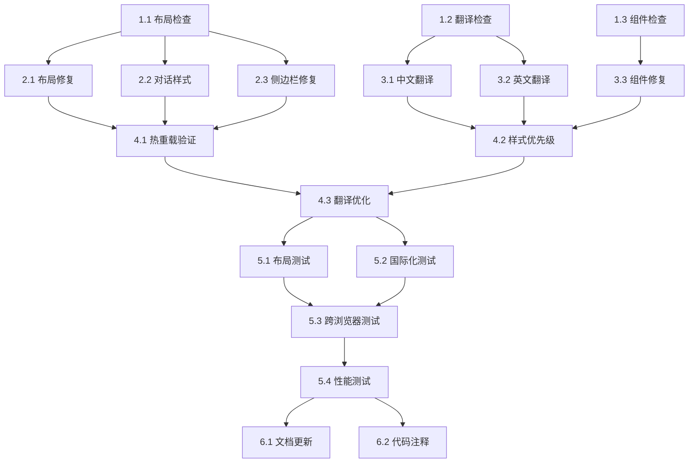

# RAG UI调整诊断系统任务分解

## 任务概述

本文档将RAG UI调整诊断系统的开发工作分解为具体的实施任务，按照优先级和依赖关系进行组织，确保系统性地解决RAG聊天界面的布局和国际化问题。

## 阶段1：问题诊断和分析

### 任务1.1：检查当前布局状态
- **文件**: src/pages/RAGSystem/styles.css, src/pages/RAGSystem/components/RAGChat.css
- **描述**: 分析当前CSS样式，找出对话框未占满右侧屏幕的原因
- **验收标准**:
  - 检查.rag-chat-section的flex属性设置
  - 验证容器高度计算是否正确（100vh）
  - 确认没有CSS优先级冲突
  - 记录当前的布局问题
- **优先级**: 高
- **预估时间**: 1小时

### 任务1.2：检查翻译文件完整性
- **文件**: src/locales/zh-CN.ts, src/locales/en-US.ts
- **描述**: 验证翻译文件的完整性，特别是RAG相关的键值
- **验收标准**:
  - 检查ragSystem.sidebar.newConversation键值是否存在
  - 验证ragSystem.toolbar.fileManagement翻译是否正确
  - 确认所有RAG相关翻译键都已定义
  - 记录缺失或错误的翻译键
- **优先级**: 高
- **预估时间**: 45分钟

### 任务1.3：检查组件翻译引用
- **文件**: src/pages/RAGSystem/components/ChatSidebar.tsx, src/pages/RAGSystem/components/RAGToolbar.tsx
- **描述**: 检查组件中翻译键的引用是否正确
- **验收标准**:
  - 验证useTranslation钩子的使用
  - 检查翻译键格式是否正确
  - 确认组件重新渲染机制正常
  - 记录翻译引用问题
- **优先级**: 高
- **预估时间**: 1小时

## 阶段2：布局问题修复

### 任务2.1：修复主布局样式
- **文件**: src/pages/RAGSystem/styles.css
- **描述**: 修改CSS样式确保对话框占满右侧屏幕
- **验收标准**:
  - 设置.rag-chat-section的flex: 1属性
  - 确保容器高度为100vh
  - 添加min-width: 0防止flex收缩问题
  - 验证布局在不同屏幕尺寸下正确显示
- **优先级**: 高
- **预估时间**: 1.5小时

### 任务2.2：优化对话组件样式
- **文件**: src/pages/RAGSystem/components/RAGChat.css
- **描述**: 调整对话组件的样式以支持紧凑布局
- **验收标准**:
  - 减少消息间距至少30%
  - 优化行高保持可读性
  - 确保滚动功能正常
  - 验证响应式设计
- **优先级**: 中
- **预估时间**: 1.5小时

### 任务2.3：修复侧边栏布局
- **文件**: src/pages/RAGSystem/styles.css
- **描述**: 确保侧边栏保持固定宽度，配合主内容区布局
- **验收标准**:
  - 侧边栏宽度固定为280px
  - 主内容区宽度为calc(100% - 288px)
  - 验证布局在窗口调整大小时正确响应
- **优先级**: 高
- **预估时间**: 1小时

## 阶段3：国际化问题修复

### 任务3.1：完善中文翻译文件
- **文件**: src/locales/zh-CN.ts
- **描述**: 添加或修正缺失的RAG相关翻译键值
- **验收标准**:
  - 添加ragSystem.sidebar.newConversation: "新建对话"
  - 添加ragSystem.toolbar.fileManagement: "文件管理"
  - 补充所有缺失的RAG相关翻译
  - 确保翻译文本准确反映功能含义
- **优先级**: 高
- **预估时间**: 45分钟

### 任务3.2：完善英文翻译文件
- **文件**: src/locales/en-US.ts
- **描述**: 确保英文翻译文件与中文版本保持同步
- **验收标准**:
  - 添加对应的英文翻译键值
  - 保持翻译键结构一致性
  - 验证英文翻译的准确性
- **优先级**: 中
- **预估时间**: 30分钟

### 任务3.3：修复组件翻译引用
- **文件**: src/pages/RAGSystem/components/ChatSidebar.tsx, src/pages/RAGSystem/components/RAGToolbar.tsx
- **描述**: 修正组件中的翻译键引用错误
- **验收标准**:
  - 替换错误的翻译键为正确的键值
  - 确保所有翻译调用都有fallback文本
  - 验证翻译参数正确传递
  - 添加错误处理机制
- **优先级**: 高
- **预估时间**: 1.5小时

## 阶段4：系统集成和优化

### 任务4.1：验证热重载功能
- **文件**: src/pages/RAGSystem/styles.css, src/locales/zh-CN.ts
- **描述**: 确保CSS和翻译文件的修改能够正确热重载
- **验收标准**:
  - CSS修改在500ms内反映到界面
  - 翻译文件修改立即生效
  - 验证开发服务器热重载配置
- **优先级**: 中
- **预估时间**: 45分钟

### 任务4.2：添加样式优先级保护
- **文件**: src/pages/RAGSystem/styles.css
- **描述**: 防止CSS样式被其他样式覆盖
- **验收标准**:
  - 使用更具体的选择器
  - 添加!important声明（如果必要）
  - 验证样式优先级正确
- **优先级**: 中
- **预估时间**: 1小时

### 任务4.3：优化翻译加载机制
- **文件**: src/utils/i18n.ts, src/pages/RAGSystem/index.tsx
- **描述**: 优化翻译文件的加载和缓存机制
- **验收标准**:
  - 翻译文件不阻塞界面渲染
  - 实现翻译结果缓存
  - 添加翻译加载错误处理
- **优先级**: 中
- **预估时间**: 1小时

## 阶段5：测试和验证

### 任务5.1：创建布局测试用例
- **文件**: src/__tests__/pages/RAGSystem/layout.test.tsx
- **描述**: 创建布局相关的测试用例
- **验收标准**:
  - 测试对话区域占满右侧空间
  - 验证侧边栏固定宽度
  - 测试响应式布局
  - 截图对比验证视觉正确性
- **优先级**: 中
- **预估时间**: 2小时

### 任务5.2：创建国际化测试用例
- **文件**: src/__tests__/pages/RAGSystem/i18n.test.tsx
- **描述**: 创建国际化相关的测试用例
- **验收标准**:
  - 测试翻译键正确解析
  - 验证语言切换功能
  - 测试参数插值功能
  - 检查fallback机制
- **优先级**: 中
- **预估时间**: 2小时

### 任务5.3：执行跨浏览器测试
- **文件**: 无（使用浏览器开发者工具）
- **描述**: 在不同浏览器中验证修复效果
- **验收标准**:
  - Chrome 90+兼容性验证
  - Firefox 88+兼容性验证
  - Safari 14+兼容性验证
  - Edge 90+兼容性验证
- **优先级**: 中
- **预估时间**: 1.5小时

### 任务5.4：性能测试和优化
- **文件**: src/pages/RAGSystem/styles.css, src/pages/RAGSystem/index.tsx
- **描述**: 验证性能影响并进行优化
- **验收标准**:
  - CSS渲染性能无明显下降
  - 翻译加载不影响首屏渲染
  - 验证热重载性能
- **优先级**: 低
- **预估时间**: 1小时

## 阶段6：文档和维护

### 任务6.1：更新使用文档
- **文件**: docs/RAG_SYSTEM.md
- **描述**: 更新RAG系统的使用文档
- **验收标准**:
  - 记录布局调整说明
  - 说明翻译配置方法
  - 添加故障排除指南
  - 更新界面截图
- **优先级**: 低
- **预估时间**: 1.5小时

### 任务6.2：添加代码注释
- **文件**: src/pages/RAGSystem/styles.css, src/locales/zh-CN.ts
- **描述**: 为关键修改添加详细注释
- **验收标准**:
  - 解释布局逻辑
  - 说明翻译键用途
  - 添加维护说明
- **优先级**: 低
- **预估时间**: 45分钟

## 任务依赖关系

## 任务优先级说明

- **高优先级**: 核心问题修复，影响用户体验的关键功能
- **中优先级**: 增强功能和优化，提高系统稳定性
- **低优先级**: 文档和维护，在核心功能完成后进行

## 验收标准

每个任务完成后需要满足以下条件：
1. 界面修改立即反映在浏览器中
2. 翻译文本正确显示中文
3. 布局在不同屏幕尺寸下正确显示
4. 代码通过TypeScript编译检查
5. 相关测试用例通过

## 风险识别

1. **CSS优先级冲突**: 可能被其他全局样式覆盖
2. **翻译键重复**: 可能与其他功能的翻译键冲突
3. **浏览器兼容性**: 不同浏览器对CSS的解析可能有差异
4. **热重载延迟**: 开发服务器可能影响样式更新速度

## 里程碑

- **里程碑1**: 完成问题诊断 (任务1.1-1.3)
- **里程碑2**: 完成布局修复 (任务2.1-2.3)
- **里程碑3**: 完成国际化修复 (任务3.1-3.3)
- **里程碑4**: 完成系统集成 (任务4.1-4.3)
- **里程碑5**: 完成测试验证 (任务5.1-5.4)
- **里程碑6**: 完成文档维护 (任务6.1-6.2)

## 预期成果

完成所有任务后，将实现：
1. **布局优化**: 对话框占满右侧屏幕，用户体验显著提升
2. **国际化完善**: 所有界面文本正确显示中文，无变量名显示
3. **系统稳定性**: 样式和翻译修改能够正确生效
4. **开发效率**: 完善的测试和文档支持后续维护

总预估时间：约25小时，重点关注前4个阶段的核心问题修复。