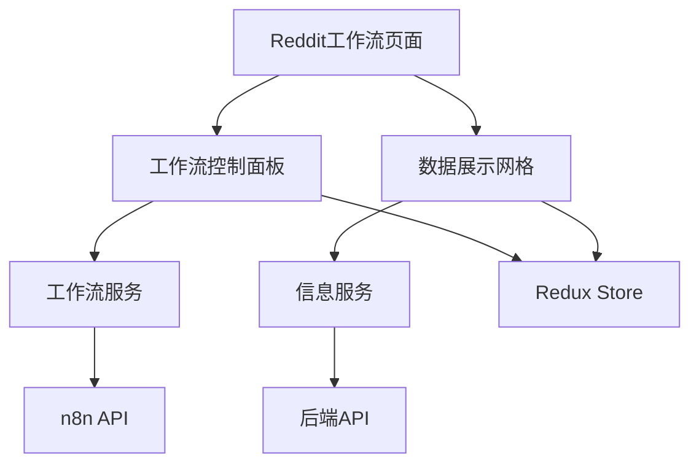

# Design Document

## Overview

Reddit热门内容抓取工作流是一个集成到现有信息仪表板系统中的新功能模块。该功能通过与n8n工作流系统集成，实现Reddit热门内容的自动抓取、处理和展示。设计遵循现有系统的架构模式，提供用户友好的工作流控制界面和数据展示组件。

## Steering Document Alignment

### Technical Standards (tech.md)
- 遵循React + TypeScript + Redux Toolkit技术栈
- 使用Ant Design组件库保持UI一致性
- 采用现有的国际化(i18n)框架
- 遵循现有的错误处理和通知机制

### Project Structure (structure.md)
- 组件放置在`src/components/`目录下
- 服务层代码放置在`src/services/`目录下
- 类型定义放置在`src/types/`目录下
- Redux状态管理放置在`src/store/slices/`目录下

## Code Reuse Analysis

### Existing Components to Leverage
- **Layout组件**: 使用现有的页面布局和导航结构
- **Notification组件**: 复用现有的通知系统显示操作结果
- **Loading组件**: 使用现有的加载状态组件
- **Button/Card组件**: 复用Ant Design组件保持UI一致性

### Integration Points
- **工作流服务**: 扩展现有的`workflowService.ts`以支持Reddit工作流
- **信息服务**: 扩展现有的`informationService.ts`以处理Reddit数据
- **Redux Store**: 集成到现有的状态管理系统
- **路由系统**: 集成到现有的路由配置中

## Architecture

该功能采用分层架构设计，遵循关注点分离原则：

### Modular Design Principles
- **Single File Responsibility**: 每个组件文件专注于单一功能
- **Component Isolation**: 创建小而专注的组件而非大型单体文件
- **Service Layer Separation**: 分离数据访问、业务逻辑和展示层
- **Utility Modularity**: 将工具函数拆分为专注的单一用途模块



## Components and Interfaces

### RedditWorkflowPage
- **Purpose:** 主页面组件，整合工作流控制和数据展示
- **Interfaces:** 无公共接口，作为容器组件
- **Dependencies:** WorkflowControlPanel, DataDisplayGrid, Redux hooks
- **Reuses:** Layout组件、现有页面结构模式

### WorkflowControlPanel
- **Purpose:** 工作流触发和状态控制面板
- **Interfaces:** 
  - `onTriggerWorkflow(): void` - 触发工作流
  - `onStopWorkflow(): void` - 停止工作流
- **Dependencies:** workflowService, notification hooks
- **Reuses:** Ant Design Button, Card, Spin组件

### DataDisplayGrid
- **Purpose:** Reddit数据的网格展示组件
- **Interfaces:**
  - `data: RedditPost[]` - 展示的数据
  - `loading: boolean` - 加载状态
  - `onRefresh(): void` - 刷新数据
- **Dependencies:** informationService, Redux state
- **Reuses:** Ant Design Table, Card, Tag组件

### RedditPostCard
- **Purpose:** 单个Reddit帖子的卡片展示组件
- **Interfaces:**
  - `post: RedditPost` - 帖子数据
  - `onClick?: (post: RedditPost) => void` - 点击回调
- **Dependencies:** 无外部依赖
- **Reuses:** Ant Design Card, Typography, Space组件

## Data Models

### RedditPost
```typescript
interface RedditPost {
  id: string;                    // Reddit帖子唯一标识
  title: string;                 // 帖子标题
  author: string;                // 作者用户名
  subreddit: string;             // 所属子版块
  score: number;                 // 得分/点赞数
  numComments: number;           // 评论数量
  url: string;                   // 帖子链接
  permalink: string;             // Reddit永久链接
  createdUtc: number;            // 创建时间(UTC时间戳)
  thumbnail?: string;            // 缩略图URL
  selftext?: string;             // 帖子正文内容
  isVideo: boolean;              // 是否为视频内容
  over18: boolean;               // 是否为成人内容
  spoiler: boolean;              // 是否为剧透内容
  stickied: boolean;             // 是否为置顶帖
}
```

### WorkflowStatus
```typescript
interface WorkflowStatus {
  id: string;                    // 工作流唯一标识
  name: string;                  // 工作流名称
  status: 'idle' | 'running' | 'completed' | 'error'; // 执行状态
  lastRun?: Date;                // 最后执行时间
  nextRun?: Date;                // 下次执行时间
  errorMessage?: string;         // 错误信息
  executionCount: number;        // 执行次数
}
```

### RedditWorkflowConfig
```typescript
interface RedditWorkflowConfig {
  subreddits: string[];          // 目标子版块列表
  sortBy: 'hot' | 'new' | 'top'; // 排序方式
  timeRange?: 'hour' | 'day' | 'week' | 'month' | 'year' | 'all'; // 时间范围
  limit: number;                 // 抓取数量限制
  includeNSFW: boolean;          // 是否包含成人内容
  autoRefreshInterval?: number;  // 自动刷新间隔(分钟)
}
```

## Error Handling

### Error Scenarios
1. **工作流触发失败**
   - **Handling:** 捕获API错误，显示具体错误信息
   - **User Impact:** 显示错误通知，提供重试选项

2. **数据获取失败**
   - **Handling:** 实现重试机制，记录错误日志
   - **User Impact:** 显示加载失败状态，提供手动刷新按钮

3. **网络连接问题**
   - **Handling:** 检测网络状态，提供离线模式提示
   - **User Impact:** 显示网络错误提示，建议检查连接

4. **数据格式错误**
   - **Handling:** 数据验证和清理，记录异常数据
   - **User Impact:** 跳过异常数据，显示部分结果

5. **权限不足**
   - **Handling:** 检查用户权限，提供权限申请指引
   - **User Impact:** 显示权限不足提示，引导联系管理员

## Testing Strategy

### Unit Testing
- **组件测试**: 使用React Testing Library测试组件渲染和交互
- **服务测试**: 使用Jest测试API调用和数据处理逻辑
- **Redux测试**: 测试actions、reducers和selectors
- **工具函数测试**: 测试数据转换和验证函数

### Integration Testing
- **API集成测试**: 测试与n8n工作流系统的集成
- **组件集成测试**: 测试组件间的数据流和交互
- **状态管理集成**: 测试Redux状态更新和组件响应

### End-to-End Testing
- **工作流触发流程**: 测试完整的工作流触发和状态更新
- **数据展示流程**: 测试从数据获取到展示的完整流程
- **错误处理流程**: 测试各种错误场景的用户体验
- **国际化测试**: 测试中英文切换的完整功能