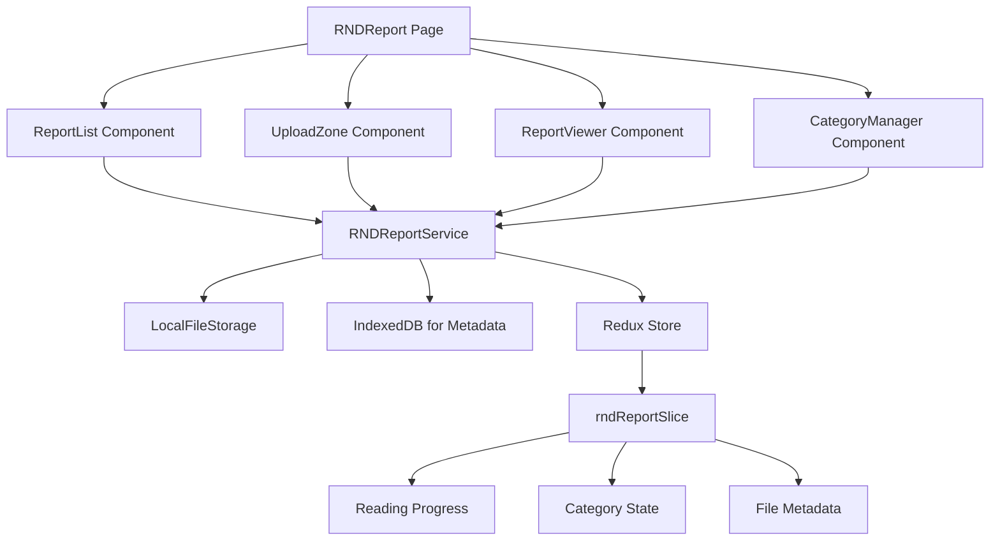

# Design Document

## Overview

The R&D Report module is a comprehensive HTML document management system that integrates seamlessly with the existing WendealDashboard architecture. The module provides drag-and-drop file upload, categorized organization, reading progress tracking, and visual fidelity preservation for technical reports.

The design follows the established patterns in the codebase, utilizing React functional components, Redux Toolkit for state management, Ant Design components, and TypeScript for type safety.

## Steering Document Alignment

### Technical Standards (tech.md)
The implementation follows the project's established technical patterns:
- **React Functional Components**: All components use functional components with hooks
- **Redux Toolkit**: State management uses RTK slices and selectors
- **Ant Design**: UI components follow Ant Design patterns and theming
- **TypeScript**: Full type safety with interfaces for all data models
- **Lazy Loading**: Route-based code splitting for performance

### Project Structure (structure.md)
The module follows the project's component organization:
- **Independent Module**: Located in `src/pages/RNDReport/` with its own subdirectories
- **Service Layer**: Business logic separated in `src/services/rndReportService.ts`
- **Type Definitions**: Data models defined in `src/types/rndReport.ts`
- **Redux Integration**: State management through `src/store/slices/rndReportSlice.ts`

## Code Reuse Analysis

### Existing Components to Leverage

- **Layout System**: `MainLayout.tsx` for sidebar navigation integration
- **Modal System**: `Modal.tsx` for settings and management dialogs
- **Theme System**: `ThemeContext.tsx` for consistent theming
- **Notification System**: `NotificationCenter.tsx` for user feedback
- **Error Handling**: `ErrorModal.tsx` for consistent error presentation
- **Loading States**: `Loading.tsx` for upload and processing states
- **File Handling**: Extend existing file utilities for HTML processing

### Integration Points

- **Router Integration**: Add route to `routes.ts` following existing pattern
- **Navigation Integration**: Extend `navigationItems` for sidebar menu
- **Authentication**: Use existing `AuthContext` for access control
- **Internationalization**: Use `react-i18next` for multilingual support

## Architecture

### Modular Design Principles

- **Single File Responsibility**: Each component handles one specific concern
- **Component Isolation**: Components are self-contained with clear interfaces
- **Service Layer Separation**: Data access and business logic separated
- **Utility Modularity**: File processing utilities in dedicated modules



## Components and Interfaces

### RNDReport Main Page
- **Purpose:** Main container component that orchestrates the report management interface
- **Interfaces:**
  - `handleFileUpload(files: FileList): Promise<void>`
  - `handleCategoryChange(categoryId: string): void`
  - `handleReportOpen(reportId: string): void`
- **Dependencies:** All sub-components, RNDReportService
- **Reuses:** MainLayout for navigation, ThemeContext for theming

### UploadZone Component
- **Purpose:** Handles drag-and-drop file upload with visual feedback
- **Interfaces:**
  - `onFilesAccepted(files: File[]): void`
  - `onUploadProgress(progress: number): void`
- **Dependencies:** react-dropzone library
- **Reuses:** Loading component for upload states

### ReportList Component
- **Purpose:** Displays categorized list of reports with search and filtering
- **Interfaces:**
  - `onReportSelect(reportId: string): void`
  - `onCategoryFilter(categoryId: string): void`
  - `onSearch(query: string): void`
- **Dependencies:** Ant Design List, Input components
- **Reuses:** Existing filter and search patterns from other modules

### ReportViewer Component
- **Purpose:** Renders HTML reports with reading progress tracking
- **Interfaces:**
  - `onProgressUpdate(progress: number): void`
  - `onSettingsOpen(): void`
- **Dependencies:** iframe-resizer for responsive iframe handling
- **Reuses:** Modal component for settings dialog

### CategoryManager Component
- **Purpose:** Manages report categories with CRUD operations
- **Interfaces:**
  - `onCategoryCreate(name: string): Promise<void>`
  - `onCategoryUpdate(id: string, name: string): Promise<void>`
  - `onCategoryDelete(id: string): Promise<void>`
- **Dependencies:** Ant Design Form, Modal components
- **Reuses:** Existing form validation patterns

## Data Models

### Report Model
```typescript
interface Report {
  id: string;
  name: string;
  originalName: string;
  filePath: string;
  categoryId: string;
  fileSize: number;
  uploadDate: Date;
  lastReadDate?: Date;
  readingProgress: number; // 0-100
  metadata: {
    title?: string;
    description?: string;
    author?: string;
    createdDate?: Date;
  };
}
```

### Category Model
```typescript
interface Category {
  id: string;
  name: string;
  description?: string;
  color?: string;
  reportCount: number;
  createdDate: Date;
}
```

### Upload State Model
```typescript
interface UploadState {
  isUploading: boolean;
  progress: number;
  currentFile?: string;
  error?: string;
}
```

## File Storage Design

### Local File System Storage
- **Directory Structure:**
  ```
  userData/rnd-reports/
  ├── files/           # HTML files
  │   ├── report-1.html
  │   ├── report-2.html
  │   └── ...
  ├── metadata/        # JSON metadata files
  │   ├── report-1.json
  │   └── report-2.json
  └── index.json       # Master index file
  ```

### IndexedDB for Metadata
- **Purpose:** Fast querying and search capabilities
- **Stores:**
  - Report metadata and reading progress
  - Category definitions
  - Search indexes
  - User preferences

### File Processing Pipeline
1. **Validation:** File type, size, and content verification
2. **Processing:** Extract metadata from HTML (title, description)
3. **Storage:** Save file to local directory
4. **Indexing:** Update IndexedDB with metadata
5. **Notification:** Update UI state and notify user

## Error Handling

### Error Scenarios

1. **File Upload Errors**
   - **Invalid File Type:** HTML files only accepted
   - **File Too Large:** Maximum 50MB per file
   - **Corrupted File:** HTML parsing validation
   - **Disk Space:** Insufficient storage space
   - **Handling:** Show specific error messages, prevent upload
   - **User Impact:** Clear feedback with retry options

2. **File Reading Errors**
   - **File Not Found:** Report deleted or moved
   - **Permission Denied:** File access issues
   - **Corrupted Content:** HTML rendering failures
   - **Handling:** Graceful fallback with error recovery
   - **User Impact:** Alternative viewing options or error recovery

3. **Storage Errors**
   - **Disk Full:** No space for new files
   - **Permission Issues:** Cannot write to storage
   - **Corrupted Index:** Database integrity issues
   - **Handling:** Automatic recovery and user notification
   - **User Impact:** Minimal disruption with automatic fixes

## Testing Strategy

### Unit Testing
- **Component Testing:** Individual component behavior
- **Hook Testing:** Custom hooks for data management
- **Service Testing:** File processing and storage operations
- **Utility Testing:** File validation and metadata extraction

### Integration Testing
- **File Upload Flow:** End-to-end upload process
- **Reading Progress:** Progress tracking accuracy
- **Category Management:** CRUD operations for categories
- **Search Functionality:** Report filtering and search

### End-to-End Testing
- **Complete User Flows:** Upload → Categorize → Read → Track Progress
- **Error Recovery:** Network issues and file corruption
- **Performance Testing:** Large file handling and UI responsiveness
- **Cross-browser Testing:** HTML rendering consistency

## Technology Choices

### Core Technologies
- **React 19:** Modern React with hooks and concurrent features
- **TypeScript:** Full type safety and better developer experience
- **Ant Design:** Consistent UI components and theming
- **Redux Toolkit:** Predictable state management

### Specialized Libraries
- **react-dropzone:** Drag-and-drop file upload (6.9 trust score)
- **iframe-resizer:** Responsive iframe handling for HTML rendering
- **IndexedDB:** Client-side database for metadata and search
- **File System API:** Local file storage and management

### Performance Optimizations
- **Lazy Loading:** Route-based code splitting
- **Virtual Scrolling:** For large report lists
- **Debounced Search:** Efficient search with minimal API calls
- **Memory Management:** Proper cleanup of file handles and DOM elements

This design ensures the R&D Report module is robust, performant, and maintains the same quality standards as the existing codebase while providing a comprehensive document management solution.