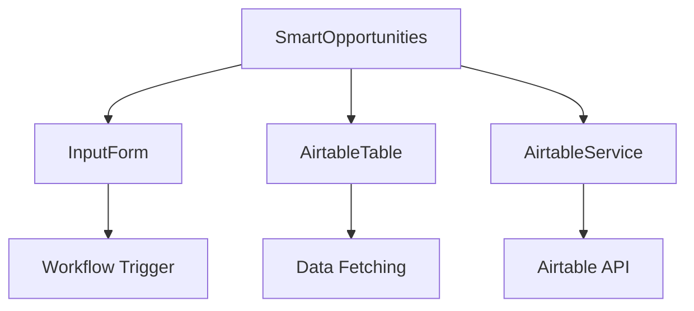

# Design Document

## Overview

Smart-opportunities is a React component that integrates with Airtable to display business opportunity data based on user-provided parameters (industry, city, country). The component follows the existing Information Dashboard patterns and integrates with the workflow system.

## Steering Document Alignment

### Technical Standards (tech.md)
- **React Hooks**: Uses functional components with custom hooks
- **TypeScript**: Full type safety for all interfaces and components
- **Ant Design**: Consistent with existing UI component library
- **Redux Toolkit**: State management follows existing patterns
- **ESLint/Prettier**: Code formatting and linting standards

### Project Structure (structure.md)
- **Components**: Located in `src/pages/InformationDashboard/components/`
- **Services**: Airtable integration in `src/services/`
- **Types**: Type definitions in `src/types/`
- **Utilities**: Helper functions in `src/utils/`

## Code Reuse Analysis

### Existing Components to Leverage
- **WorkflowSidebar**: Reuses workflow selection and trigger patterns
- **ResultPanel**: Reuses data display patterns
- **InformationDashboard**: Reuses layout and state management

### Integration Points
- **Redux Store**: Uses existing informationDashboardSlice for workflow state
- **API Services**: Integrates with existing workflow service patterns
- **UI Components**: Uses existing Card, Button, Input components from Ant Design

## Architecture

The Smart-opportunities feature follows a modular architecture with clear separation of concerns:

### Modular Design Principles
- **Single File Responsibility**: Each component handles one specific concern
- **Component Isolation**: SmartOpportunities is self-contained but integrates cleanly
- **Service Layer Separation**: Airtable integration is separated from UI logic
- **Utility Modularity**: Helper functions are focused and reusable



## Components and Interfaces

### SmartOpportunities (Main Component)
- **Purpose:** Main container component that orchestrates the entire feature
- **Interfaces:** React.FC with props for workflow integration
- **Dependencies:** Ant Design components, Redux hooks, custom hooks
- **Reuses:** Existing Card and layout patterns

### InputForm Component
- **Purpose:** Handles user input for industry, city, and country parameters
- **Interfaces:** Form submission callbacks, validation states
- **Dependencies:** Ant Design Form and Input components
- **Reuses:** Existing form validation patterns

### AirtableTable Component
- **Purpose:** Displays fetched data in a structured table format
- **Interfaces:** Data props, loading states, error handling
- **Dependencies:** Ant Design Table component
- **Reuses:** Existing table display patterns from ResultPanel

### AirtableService
- **Purpose:** Handles all Airtable API interactions
- **Interfaces:** Promise-based methods for data fetching
- **Dependencies:** Airtable.js library
- **Reuses:** Existing service patterns and error handling

## Data Models

### OpportunityRecord
```typescript
interface OpportunityRecord {
  id: string;
  fields: {
    businessName: string;
    industry: string;
    city: string;
    country: string;
    description: string;
    contactInfo?: string;
    createdTime: string;
  };
  createdTime: string;
}
```

### WorkflowParameters
```typescript
interface WorkflowParameters {
  industry: string;
  city: string;
  country: string;
}
```

### AirtableConfig
```typescript
interface AirtableConfig {
  apiKey: string;
  baseId: string;
  tableName: string;
}
```

## Error Handling

### Error Scenarios

1. **Network Failure**: Airtable API unavailable
   - **Handling:** Retry with exponential backoff, show user-friendly error message
   - **User Impact:** Clear error message with retry button

2. **Invalid API Key**: Authentication failure
   - **Handling:** Log error securely, show configuration error
   - **User Impact:** Generic "service unavailable" message

3. **Invalid Parameters**: Empty or malformed input
   - **Handling:** Client-side validation with immediate feedback
   - **User Impact:** Form validation messages

4. **Rate Limiting**: Too many requests
   - **Handling:** Queue requests, implement backoff
   - **User Impact:** Loading indicator with estimated wait time

## Testing Strategy

### Unit Testing
- **Components**: Test each component in isolation with mocked props
- **Services**: Test AirtableService with mocked API responses
- **Utilities**: Test helper functions with various input scenarios
- **Hooks**: Test custom hooks with different state scenarios

### Integration Testing
- **Workflow Integration**: Test with actual workflow sidebar
- **Data Flow**: Test complete data flow from input to display
- **Error Scenarios**: Test error handling and recovery

### End-to-End Testing
- **Complete Workflow**: Test from parameter input to data display
- **Error Recovery**: Test network failures and recovery
- **Performance**: Test with large datasets (1000+ records)

## Security Considerations

- **API Key Protection**: Never expose API keys in client-side code
- **Input Sanitization**: Validate and sanitize all user inputs
- **Rate Limiting**: Implement client-side rate limiting
- **Error Information**: Avoid exposing sensitive error details to users

## Performance Optimizations

- **Lazy Loading**: Load AirtableTable component only when needed
- **Pagination**: Implement server-side pagination for large datasets
- **Caching**: Cache frequently accessed data
- **Debouncing**: Debounce rapid parameter changes

## Accessibility

- **Keyboard Navigation**: Ensure all interactive elements are keyboard accessible
- **Screen Reader**: Proper ARIA labels and semantic HTML
- **Color Contrast**: Maintain adequate contrast ratios
- **Focus Management**: Proper focus handling in forms and modals