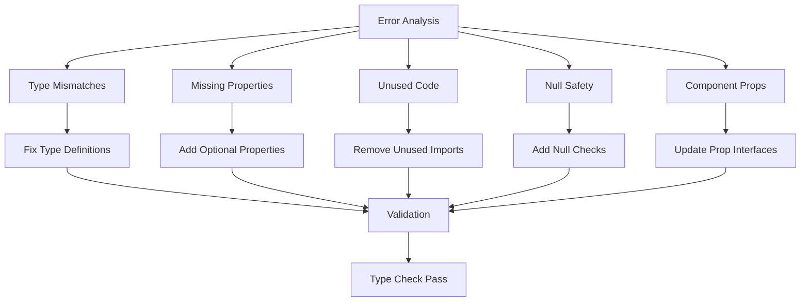

# Design Document

## Overview

This design addresses the systematic fixing of TypeScript compilation errors across the WendealDashboard codebase. The feature will implement a comprehensive error resolution strategy that categorizes errors by type and applies targeted fixes while maintaining code quality and type safety. The implementation will follow a modular approach, addressing errors in logical groups to ensure maintainability and prevent regression.

## Steering Document Alignment

### Technical Standards (tech.md)
The design follows TypeScript best practices and React development patterns established in the project. It maintains strict type checking, proper interface definitions, and clean code principles. Error fixes will preserve existing architectural patterns and coding standards.

### Project Structure (structure.md)
The implementation will follow the existing project structure with components in `src/components/`, services in `src/services/`, and utilities in `src/utils/`. Type definitions will be maintained in their respective domain folders, and fixes will not introduce new structural changes unless absolutely necessary for type safety.

## Code Reuse Analysis

### Existing Components to Leverage
- **TypeScript Configuration**: Utilize existing `tsconfig.json` settings and ESLint rules
- **Component Architecture**: Maintain existing React component patterns and prop interfaces
- **Service Layer**: Preserve existing service architecture and API contracts
- **Utility Functions**: Leverage existing utility functions for type checking and validation

### Integration Points
- **Build System**: Integrate with existing TypeScript compilation and linting processes
- **Component Library**: Work within existing Ant Design and custom component interfaces
- **State Management**: Maintain compatibility with Redux store and slice patterns
- **API Services**: Preserve existing service interfaces and response types

## Architecture

The design follows a systematic, error-category-driven approach to TypeScript error resolution. Each error type is addressed through targeted fixes that maintain code modularity and type safety.

### Modular Design Principles
- **Single File Responsibility**: Each file fix addresses specific error types within that file
- **Component Isolation**: Fixes are isolated to affected components without cascading changes
- **Service Layer Separation**: Type fixes maintain separation between data, business logic, and presentation
- **Utility Modularity**: Type utilities and interfaces remain focused and reusable



## Components and Interfaces

### Error Categorization Module
- **Purpose:** Analyzes and categorizes TypeScript errors by type and severity
- **Interfaces:** `ErrorCategory`, `ErrorLocation`, `FixStrategy`
- **Dependencies:** TypeScript compiler API, file system utilities
- **Reuses:** Existing logging and error handling utilities

### Type Fixer Module
- **Purpose:** Applies targeted fixes based on error categorization
- **Interfaces:** `TypeFix`, `FixResult`, `ValidationResult`
- **Dependencies:** AST parsing, code transformation utilities
- **Reuses:** Existing code formatting and linting tools

### Validation Module
- **Purpose:** Validates fixes and ensures no new errors are introduced
- **Interfaces:** `ValidationReport`, `ErrorRegression`
- **Dependencies:** TypeScript compiler, test runners
- **Reuses:** Existing test utilities and CI/CD validation scripts

## Data Models

### ErrorReport Model
```
interface ErrorReport {
  file: string;
  line: number;
  column: number;
  errorCode: string;
  message: string;
  category: 'type-mismatch' | 'missing-property' | 'unused-variable' | 'null-safety' | 'component-props';
  severity: 'critical' | 'warning' | 'info';
  fixStrategy: string;
  applied: boolean;
  validated: boolean;
}
```

### FixResult Model
```
interface FixResult {
  errorId: string;
  success: boolean;
  changes: CodeChange[];
  validationPassed: boolean;
  newErrors: ErrorReport[];
  timestamp: Date;
}
```

## Error Handling

### Error Scenarios
1. **Fix Application Failure:** When a fix cannot be applied due to complex code dependencies
   - **Handling:** Log detailed error information and mark for manual review
   - **User Impact:** Clear indication in reports that manual intervention is needed

2. **New Errors Introduced:** When fixes create additional TypeScript errors
   - **Handling:** Rollback changes and flag for alternative approaches
   - **User Impact:** Validation reports highlight regression issues

3. **Type Definition Conflicts:** When fixes conflict with existing type definitions
   - **Handling:** Analyze dependencies and apply minimal viable fixes
   - **User Impact:** Detailed conflict reports for architectural decisions

## Testing Strategy

### Unit Testing
- Test individual error fix functions with mock TypeScript errors
- Validate fix application logic for each error category
- Test type validation and regression detection

### Integration Testing
- Test complete error resolution workflows on sample files
- Validate integration with existing build and lint processes
- Test error categorization accuracy across different code patterns

### End-to-End Testing
- Run full TypeScript compilation after all fixes
- Validate that application builds successfully
- Test critical user flows to ensure functionality is preserved