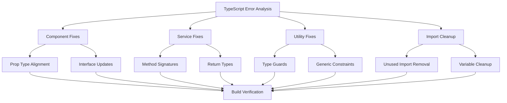

# Design Document

## Overview

This design addresses the systematic resolution of remaining TypeScript compilation errors that prevent successful project builds. The feature focuses on type safety improvements, code cleanup, and interface alignment across the entire codebase to achieve zero TypeScript errors.

## Steering Document Alignment

### Technical Standards (tech.md)
The design follows established TypeScript patterns including:
- Strict type checking with `exactOptionalPropertyTypes: true`
- Proper interface definitions and type guards
- Clean separation of concerns between components and services
- Consistent error handling patterns

### Project Structure (structure.md)
Implementation will follow the existing project organization:
- Component files in respective directories under `src/pages/`
- Service files in `src/services/`
- Utility files in `src/utils/`
- Type definitions in appropriate type files

## Code Reuse Analysis

### Existing Components to Leverage
- **TypeScript Configuration**: Reuse existing `tsconfig.json` settings and compiler options
- **Error Handling Patterns**: Extend existing error boundary and service error handling
- **Component Architecture**: Maintain existing React component patterns and prop interfaces
- **Service Layer**: Build upon existing service interfaces and method signatures

### Integration Points
- **Build System**: Integrate with existing npm scripts and build pipeline
- **Type Definitions**: Work with existing type definition files and interfaces
- **Component Library**: Maintain compatibility with existing UI component library (Ant Design)
- **State Management**: Preserve existing Redux store patterns and selectors

## Architecture

The design follows a systematic approach to TypeScript error resolution with clear separation of concerns and modular fixes.

### Modular Design Principles
- **Single File Responsibility**: Each TypeScript error fix targets specific files and concerns
- **Component Isolation**: Fix component prop types independently without affecting other components
- **Service Layer Separation**: Address service type issues separately from component concerns
- **Utility Modularity**: Clean up utility functions and their type definitions independently



## Components and Interfaces

### TypeScript Error Resolver
- **Purpose:** Central coordinator for systematic error resolution
- **Interfaces:** Error analysis methods, fix application methods
- **Dependencies:** TypeScript compiler API, file system utilities
- **Reuses:** Existing diagnostic utilities and file scanning capabilities

### Component Type Fixer
- **Purpose:** Fixes React component prop type mismatches and interface issues
- **Interfaces:** Component analysis, prop type validation, interface updates
- **Dependencies:** React type definitions, component scanning utilities
- **Reuses:** Existing component patterns and prop validation helpers

### Service Type Fixer
- **Purpose:** Resolves service layer type compatibility and method signature issues
- **Interfaces:** Service analysis, method signature validation, return type checking
- **Dependencies:** Service interfaces, type checking utilities
- **Reuses:** Existing service patterns and error handling

### Utility Type Fixer
- **Purpose:** Fixes utility function type issues and generic constraints
- **Interfaces:** Utility analysis, type guard validation, generic type checking
- **Dependencies:** TypeScript compiler utilities, reflection APIs
- **Reuses:** Existing utility patterns and type helpers

## Data Models

### TypeScriptError
```
interface TypeScriptError {
  filePath: string;
  line: number;
  column: number;
  errorCode: string;
  message: string;
  severity: 'error' | 'warning' | 'info';
  category: 'type-incompatibility' | 'unused-import' | 'missing-prop' | 'service-type' | 'utility-type';
}
```

### FixSuggestion
```
interface FixSuggestion {
  errorId: string;
  filePath: string;
  fixType: 'type-assertion' | 'import-removal' | 'interface-update' | 'method-signature' | 'generic-constraint';
  description: string;
  codeChanges: CodeChange[];
  priority: 'high' | 'medium' | 'low';
}
```

### CodeChange
```
interface CodeChange {
  startLine: number;
  endLine: number;
  originalCode: string;
  newCode: string;
  description: string;
}
```

## Error Handling

### Error Scenarios

1. **Type Incompatibility Errors**
   - **Handling:** Apply appropriate type assertions, unions, or interface updates
   - **User Impact:** Improved type safety and IntelliSense support

2. **Unused Import/Variable Errors**
   - **Handling:** Remove unused declarations or implement proper usage
   - **User Impact:** Cleaner code and reduced bundle size

3. **Missing Property Errors**
   - **Handling:** Add required properties or make them optional as appropriate
   - **User Impact:** More robust component interfaces

4. **Service Method Signature Errors**
   - **Handling:** Update method signatures to match implementations
   - **User Impact:** Better API consistency and type safety

5. **Build Failure Errors**
   - **Handling:** Comprehensive error analysis and systematic fixes
   - **User Impact:** Successful project builds and deployments

## Testing Strategy

### Unit Testing
- Test individual type fixes for correctness
- Validate component prop types after fixes
- Verify service method signatures match implementations
- Test utility function type constraints

### Integration Testing
- Test component integration after prop type fixes
- Verify service-to-service communication with corrected types
- Test utility function usage across the application
- Validate import/export relationships after cleanup

### End-to-End Testing
- Full application build verification
- Type checking passes without errors
- Runtime functionality remains intact
- Development experience improvements validated