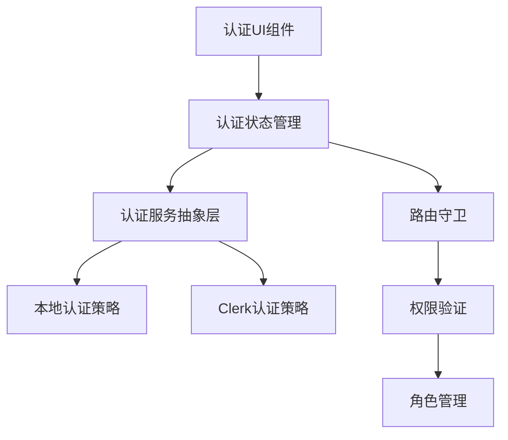

# 用户认证和权限管理系统 - 技术设计文档

## Overview

本设计文档描述了用户认证和权限管理系统的技术架构，该系统将为React+TypeScript+Ant Design仪表板应用提供完整的用户身份验证和基于角色的访问控制功能。系统采用分层架构设计，支持本地开发环境的简单认证和生产环境的Clerk集成。

## Steering Document Alignment

### Technical Standards (tech.md)
- 遵循React函数式组件和Hooks模式
- 使用TypeScript进行类型安全
- 采用Ant Design组件库保持UI一致性
- 遵循Redux Toolkit状态管理模式

### Project Structure (structure.md)
- 按功能模块组织代码结构
- 分离业务逻辑和UI组件
- 使用统一的服务层处理API调用
- 遵循现有的文件夹结构约定

## Code Reuse Analysis

### Existing Components to Leverage
- **Layout组件**: 扩展现有布局组件以支持用户信息显示和登出功能
- **RouteGuard**: 增强现有路由守卫以支持基于角色的访问控制
- **Redux Store**: 扩展现有状态管理以包含用户认证状态
- **Ant Design组件**: 复用Form、Button、Modal等组件构建认证界面

### Integration Points
- **Router系统**: 集成认证状态到现有路由保护机制
- **Redux Store**: 将用户状态集成到全局状态管理
- **API Services**: 扩展现有服务层架构处理认证相关API
- **本地存储**: 使用localStorage/sessionStorage管理认证令牌

## Architecture

系统采用分层架构模式，包含认证抽象层、状态管理层、UI组件层和路由保护层。使用策略模式实现不同环境下的认证方式切换。

### Modular Design Principles
- **Single File Responsibility**: 每个文件专注于单一认证功能（登录、注册、权限检查等）
- **Component Isolation**: 创建独立的认证组件，避免与业务逻辑耦合
- **Service Layer Separation**: 分离认证服务、用户管理服务和权限验证服务
- **Utility Modularity**: 将认证工具函数拆分为专用模块



## Components and Interfaces

### AuthProvider组件
- **Purpose:** 提供全局认证上下文和状态管理
- **Interfaces:** login, logout, register, checkAuth, updateProfile
- **Dependencies:** Redux Store, 认证服务
- **Reuses:** 现有的Context模式和Redux集成

### LoginForm组件
- **Purpose:** 用户登录界面
- **Interfaces:** onSubmit, onForgotPassword, onRegister
- **Dependencies:** Ant Design Form, 认证服务
- **Reuses:** 现有的表单验证和错误处理模式

### RegisterForm组件
- **Purpose:** 用户注册界面
- **Interfaces:** onSubmit, onLogin
- **Dependencies:** Ant Design Form, 用户服务
- **Reuses:** 现有的表单组件和验证逻辑

### RoleGuard组件
- **Purpose:** 基于角色的组件访问控制
- **Interfaces:** allowedRoles, fallback, children
- **Dependencies:** 权限验证服务
- **Reuses:** 现有的条件渲染模式

### UserProfile组件
- **Purpose:** 用户信息管理界面
- **Interfaces:** onUpdate, onChangePassword
- **Dependencies:** 用户服务, Ant Design组件
- **Reuses:** 现有的表单和模态框组件

### AuthService
- **Purpose:** 认证服务抽象层
- **Interfaces:** authenticate, validateToken, refreshToken
- **Dependencies:** 认证策略实现
- **Reuses:** 现有的API服务架构

### PermissionService
- **Purpose:** 权限验证和角色管理
- **Interfaces:** hasPermission, getUserRoles, checkAccess
- **Dependencies:** 用户状态
- **Reuses:** 现有的工具函数模式

## Data Models

### User模型
```typescript
interface User {
  id: string;
  username: string;
  email: string;
  role: UserRole;
  profile: UserProfile;
  createdAt: Date;
  lastLoginAt?: Date;
  isActive: boolean;
}
```

### UserRole模型
```typescript
type UserRole = 'admin' | 'employee';

interface RolePermissions {
  role: UserRole;
  permissions: Permission[];
  allowedRoutes: string[];
  allowedActions: string[];
}
```

### AuthState模型
```typescript
interface AuthState {
  isAuthenticated: boolean;
  user: User | null;
  token: string | null;
  loading: boolean;
  error: string | null;
  sessionExpiry: Date | null;
}
```

### Permission模型
```typescript
interface Permission {
  id: string;
  name: string;
  resource: string;
  action: string;
  description: string;
}
```

## Error Handling

### Error Scenarios
1. **认证失败:** 用户名或密码错误
   - **Handling:** 显示错误消息，清除敏感信息，记录失败次数
   - **User Impact:** 显示友好的错误提示，支持重试和密码重置

2. **会话过期:** 认证令牌失效
   - **Handling:** 自动跳转到登录页面，保存当前页面状态
   - **User Impact:** 提示会话过期，登录后恢复到原页面

3. **权限不足:** 用户访问未授权资源
   - **Handling:** 阻止访问，显示权限不足页面
   - **User Impact:** 显示403错误页面，提供返回首页选项

4. **网络错误:** API调用失败
   - **Handling:** 重试机制，降级到离线模式
   - **User Impact:** 显示网络错误提示，提供重试选项

5. **Clerk服务不可用:** 第三方认证服务故障
   - **Handling:** 自动切换到本地认证模式
   - **User Impact:** 透明切换，用户无感知

## Testing Strategy

### Unit Testing
- 认证服务函数的单元测试
- 权限验证逻辑的测试
- Redux状态管理的测试
- 认证组件的渲染和交互测试

### Integration Testing
- 登录流程的端到端测试
- 权限控制的集成测试
- 路由守卫的功能测试
- 不同认证策略的切换测试

### End-to-End Testing
- 完整的用户认证流程测试
- 角色切换和权限验证测试
- 会话管理和自动登出测试
- 错误场景的用户体验测试