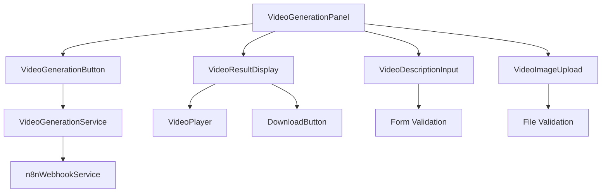

# Design Document

## Overview

The video generation workflow will be integrated into the existing Social Media dashboard as a new workflow card. It will provide users with an interface to generate videos from text descriptions and reference images, utilizing n8n webhook services for backend processing. The design follows the established patterns in the WendealDashboard for workflow management and user interaction.

## Steering Document Alignment

### Technical Standards (tech.md)
- **Frontend Framework**: React with TypeScript, following existing component patterns
- **UI Library**: Ant Design components with custom styling
- **State Management**: Redux Toolkit for global state, local state for component-specific data
- **API Communication**: RESTful API calls with proper error handling and loading states
- **File Handling**: Client-side file validation and upload using existing utilities

### Project Structure (structure.md)
- **Component Location**: `src/pages/SocialMedia/components/VideoGenerationPanel.tsx`
- **Service Integration**: Extend existing `n8nWebhookService` for video generation requests
- **Type Definitions**: Add video generation types to `src/pages/SocialMedia/types.ts`
- **Workflow Integration**: Add video generation card to `WorkflowSidebar.tsx`
- **Routing**: Integrate with existing Social Media page routing

## Code Reuse Analysis

### Existing Components to Leverage

- **WorkflowCard**: Base workflow card component from `@/components/workflow/WorkflowCard`
- **ImageGenerationPanel**: Reference implementation for similar media generation workflow
- **useFileUpload**: Existing file upload hook for image handling
- **n8nWebhookService**: Existing webhook service for API communication
- **WorkflowSidebar**: Existing sidebar component for workflow selection

### Integration Points

- **SocialMedia Page**: Add video generation workflow to existing workflow selection
- **n8n Webhook**: Send video generation requests with text and image data
- **File Upload**: Reuse existing file upload utilities with video-specific validation
- **Error Handling**: Use existing error modal and message systems

## Architecture

The video generation workflow follows a modular architecture with clear separation of concerns:

```
Video Generation Workflow
├── UI Layer (React Components)
│   ├── VideoGenerationWorkflowCard (Workflow selection)
│   ├── VideoGenerationPanel (Main interface)
│   │   ├── VideoDescriptionInput (Text input)
│   │   ├── VideoImageUpload (File upload)
│   │   ├── VideoGenerationButton (Trigger generation)
│   │   └── VideoResultDisplay (Results with download)
│   └── VideoPlayer (Video display component)
├── Service Layer
│   ├── VideoGenerationService (Business logic)
│   └── n8nWebhookService (API communication)
└── State Management
    ├── Local component state
    └── Redux for global workflow state
```

### Modular Design Principles

- **Single File Responsibility**: Each component handles one specific aspect of video generation
- **Component Isolation**: Video generation components are self-contained and reusable
- **Service Layer Separation**: Business logic separated from presentation logic
- **Utility Modularity**: File handling and validation utilities are shared across workflows



## Components and Interfaces

### VideoGenerationWorkflowCard
- **Purpose**: Workflow selection card in the sidebar
- **Interfaces**: Extends WorkflowCard props with video-specific callbacks
- **Dependencies**: WorkflowCard component, video generation icons
- **Reuses**: Existing WorkflowCard component with custom video icon

### VideoGenerationPanel
- **Purpose**: Main video generation interface with input forms and results display
- **Interfaces**: Props for workflow data, loading states, and callbacks
- **Dependencies**: Ant Design components, file upload utilities, video generation service
- **Reuses**: ImageGenerationPanel structure and patterns

### VideoDescriptionInput
- **Purpose**: Text input component for video description/prompt
- **Interfaces**: Standard input props with validation
- **Dependencies**: Ant Design Input component
- **Reuses**: Existing form input patterns

### VideoImageUpload
- **Purpose**: Image upload component for reference images
- **Interfaces**: File upload props with validation
- **Dependencies**: useFileUpload hook, Ant Design Upload component
- **Reuses**: Existing file upload utilities with image-specific validation

### VideoGenerationButton
- **Purpose**: Trigger video generation process
- **Interfaces**: Button props with loading and disabled states
- **Dependencies**: Ant Design Button, video generation service
- **Reuses**: Existing button patterns with async operation handling

### VideoResultDisplay
- **Purpose**: Display generated video with download functionality
- **Interfaces**: Video data props with download callbacks
- **Dependencies**: Video player component, download utilities
- **Reuses**: Existing result display patterns

### VideoPlayer
- **Purpose**: HTML5 video player component
- **Interfaces**: Video source props with playback controls
- **Dependencies**: Native HTML5 video element
- **Reuses**: Standard video player patterns

## Data Models

### VideoGenerationRequest
```typescript
interface VideoGenerationRequest {
  description: string;
  images: File[];
  webhookUrl: string;
  metadata?: {
    userId: string;
    timestamp: string;
    source: 'wendeal-dashboard';
  };
}
```

### VideoGenerationResponse
```typescript
interface VideoGenerationResponse {
  success: boolean;
  videoUrl?: string;
  videoId?: string;
  executionId: string;
  error?: string;
  metadata?: {
    duration: number;
    format: string;
    size: number;
  };
}
```

### VideoGenerationState
```typescript
interface VideoGenerationState {
  isGenerating: boolean;
  progress: number;
  error: string | null;
  result: VideoGenerationResponse | null;
  uploadedImages: File[];
}
```

## Error Handling

### Error Scenarios

1. **Invalid Input Data**
   - **Description**: User provides invalid text or unsupported image files
   - **Handling**: Client-side validation with immediate feedback
   - **User Impact**: Form validation messages prevent submission

2. **Webhook Connection Failure**
   - **Description**: Cannot connect to n8n webhook service
   - **Handling**: Retry logic with exponential backoff, fallback error display
   - **User Impact**: Clear error message with retry option

3. **Video Generation Timeout**
   - **Description**: Video generation takes longer than expected
   - **Handling**: Progress indicator with timeout handling
   - **User Impact**: Loading state with estimated time remaining

4. **File Upload Errors**
   - **Description**: Image upload fails due to size, format, or network issues
   - **Handling**: File validation, upload progress, error recovery
   - **User Impact**: Specific error messages for different failure types

## Testing Strategy

### Unit Testing
- VideoGenerationPanel component rendering and interactions
- VideoGenerationService business logic and API calls
- File upload validation and error handling
- Form validation and submission logic

### Integration Testing
- End-to-end video generation workflow from input to result
- n8n webhook integration and response handling
- File upload and processing pipeline
- Error scenarios and recovery mechanisms

### End-to-End Testing
- Complete user journey: select workflow → input data → generate video → view/download results
- Cross-browser compatibility for video playback
- Mobile responsiveness and touch interactions
- Network failure scenarios and offline handling