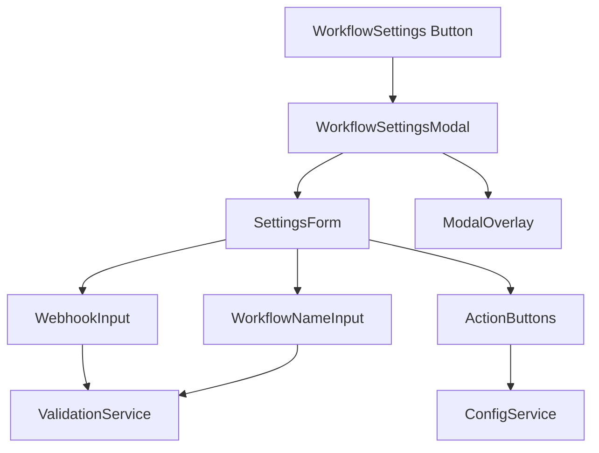

# Design Document

## Overview

工作流设置功能是一个模态弹窗组件，允许用户在当前页面上直接修改工作流配置，包括webhook地址和工作流名称。该功能集成到现有的spec-workflow系统中，提供直观的用户界面来管理工作流参数。

## Steering Document Alignment

### Technical Standards (tech.md)
由于项目中没有tech.md文档，我们将遵循React + TypeScript的最佳实践：
- 使用函数式组件和React Hooks
- TypeScript严格类型检查
- 模块化组件设计
- 状态管理使用React Context或Redux

### Project Structure (structure.md)
由于项目中没有structure.md文档，我们将遵循现有的项目结构：
- 组件放置在`src/components/`目录下
- 类型定义在`src/types/`目录下
- 服务层在`src/services/`目录下

## Code Reuse Analysis

### Existing Components to Leverage
- **Modal组件**: 利用现有的模态弹窗基础组件（如果存在）
- **Form组件**: 复用现有的表单输入组件
- **Button组件**: 使用现有的按钮组件
- **ThemeContext**: 集成现有的主题系统

### Integration Points
- **spec-workflow系统**: 与现有的工作流管理系统集成
- **本地存储**: 使用localStorage或sessionStorage保存设置
- **配置服务**: 集成现有的配置管理服务

## Architecture

该功能采用模块化设计，包含以下核心组件：

### Modular Design Principles
- **Single File Responsibility**: 每个组件文件专注于单一功能
- **Component Isolation**: 设置弹窗作为独立组件，不依赖特定页面
- **Service Layer Separation**: 配置管理逻辑与UI组件分离
- **Utility Modularity**: 验证和格式化功能作为独立工具函数



## Components and Interfaces

### WorkflowSettingsButton
- **Purpose:** 触发设置弹窗的按钮组件
- **Interfaces:** 
  - `onClick: () => void` - 打开设置弹窗
  - `className?: string` - 自定义样式类
- **Dependencies:** 无
- **Reuses:** 现有的Button组件样式

### WorkflowSettingsModal
- **Purpose:** 主要的设置弹窗容器组件
- **Interfaces:**
  - `isOpen: boolean` - 控制弹窗显示状态
  - `onClose: () => void` - 关闭弹窗回调
  - `onSave: (settings: WorkflowSettings) => void` - 保存设置回调
- **Dependencies:** SettingsForm, ModalOverlay
- **Reuses:** 现有的模态弹窗基础组件

### SettingsForm
- **Purpose:** 设置表单组件，包含输入字段和验证
- **Interfaces:**
  - `initialSettings: WorkflowSettings` - 初始设置值
  - `onSubmit: (settings: WorkflowSettings) => void` - 表单提交回调
  - `onCancel: () => void` - 取消操作回调
- **Dependencies:** WebhookInput, WorkflowNameInput, ValidationService
- **Reuses:** 现有的表单组件和验证工具

### ConfigService
- **Purpose:** 管理工作流配置的服务层
- **Interfaces:**
  - `getSettings(): WorkflowSettings` - 获取当前设置
  - `saveSettings(settings: WorkflowSettings): Promise<void>` - 保存设置
  - `validateWebhook(url: string): boolean` - 验证webhook URL
- **Dependencies:** 本地存储API
- **Reuses:** 现有的配置管理模式

## Data Models

### WorkflowSettings
```typescript
interface WorkflowSettings {
  id: string; // 唯一标识符
  workflowName: string; // 工作流名称，1-50字符
  webhookUrl: string; // webhook地址，必须是有效的HTTP/HTTPS URL
  createdAt: Date; // 创建时间
  updatedAt: Date; // 最后更新时间
}
```

### ValidationResult
```typescript
interface ValidationResult {
  isValid: boolean; // 验证是否通过
  errors: string[]; // 错误信息列表
  warnings?: string[]; // 警告信息列表（可选）
}
```

### ModalState
```typescript
interface ModalState {
  isOpen: boolean; // 弹窗是否打开
  isLoading: boolean; // 是否正在加载
  hasChanges: boolean; // 是否有未保存的更改
}
```

## Error Handling

### Error Scenarios
1. **无效的Webhook URL**
   - **Handling:** 实时验证URL格式，显示错误提示
   - **User Impact:** 红色边框高亮输入框，显示具体错误信息

2. **工作流名称为空或过长**
   - **Handling:** 字符长度验证，提供字符计数器
   - **User Impact:** 禁用保存按钮，显示字符限制提示

3. **保存失败**
   - **Handling:** 捕获保存异常，显示错误通知
   - **User Impact:** 显示错误消息，保持弹窗打开状态

4. **网络连接问题**
   - **Handling:** 检测网络状态，提供重试机制
   - **User Impact:** 显示网络错误提示，提供重试按钮

## Testing Strategy

### Unit Testing
- 测试各个组件的渲染和交互
- 验证表单验证逻辑
- 测试ConfigService的各个方法
- 模拟用户输入和事件处理

### Integration Testing
- 测试组件间的数据流
- 验证设置保存和加载流程
- 测试弹窗的打开和关闭行为
- 验证与现有系统的集成

### End-to-End Testing
- 完整的用户操作流程测试
- 从打开设置到保存配置的完整路径
- 验证设置在页面刷新后的持久性
- 测试不同浏览器的兼容性