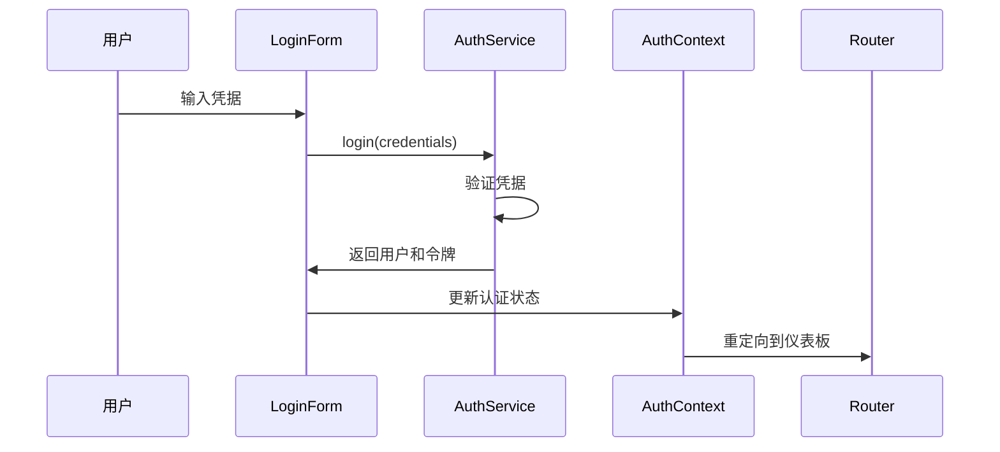
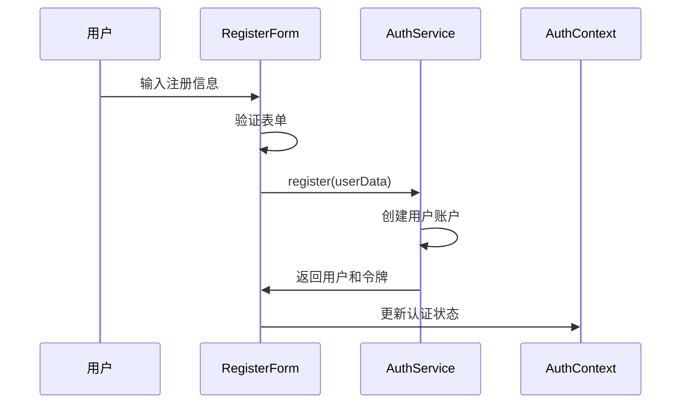

# 认证系统文档

本文档详细介绍了 Wendeal Dashboard 的认证系统架构、API 接口和使用方法。

## 目录

- [系统架构](#系统架构)
- [认证流程](#认证流程)
- [API 接口](#api-接口)
- [组件使用](#组件使用)
- [权限管理](#权限管理)
- [自定义 Hooks](#自定义-hooks)
- [工具函数](#工具函数)
- [测试指南](#测试指南)
- [最佳实践](#最佳实践)

## 系统架构

### 核心组件

```
认证系统
├── 认证上下文 (AuthContext)
├── 认证服务 (AuthService)
├── 权限服务 (PermissionService)
├── 认证组件
│   ├── LoginForm
│   ├── RegisterForm
│   ├── UserProfile
│   └── ProtectedRoute
├── 自定义 Hooks
│   ├── useAuth
│   ├── usePermission
│   └── useUserStatus
└── 工具函数
    ├── tokenUtils
    ├── userUtils
    ├── sessionUtils
    ├── passwordUtils
    ├── permissionUtils
    ├── cryptoUtils
    └── validationUtils
```

### 数据流

1. **用户登录** → AuthService.login() → 更新 AuthContext → 重定向到仪表板
2. **权限检查** → PermissionService → 基于用户角色和权限控制访问
3. **会话管理** → 自动刷新令牌 → 处理过期和错误

## 认证流程

### 登录流程



### 注册流程



## API 接口

### AuthService

#### login(credentials)

用户登录接口。

**参数：**

```typescript
interface LoginCredentials {
  username: string;
  password: string;
}
```

**返回值：**

```typescript
interface AuthResponse {
  user: User;
  token: string;
  refreshToken: string;
}
```

**使用示例：**

```typescript
import { LocalAuthService } from '@/services/auth/LocalAuthService';

const authService = new LocalAuthService();

try {
  const response = await authService.login({
    username: 'user@example.com',
    password: 'password123',
  });
  console.log('登录成功:', response.user);
} catch (error) {
  console.error('登录失败:', error.message);
}
```

#### register(userData)

用户注册接口。

**参数：**

```typescript
interface RegisterData {
  username: string;
  email: string;
  password: string;
}
```

**返回值：**

```typescript
interface AuthResponse {
  user: User;
  token: string;
  refreshToken: string;
}
```

#### getCurrentUser()

获取当前用户信息。

**返回值：**

```typescript
User | null;
```

#### updateProfile(profileData)

更新用户资料。

**参数：**

```typescript
interface ProfileUpdateData {
  firstName?: string;
  lastName?: string;
  avatar?: string;
  bio?: string;
  phone?: string;
  address?: string;
  dateOfBirth?: string;
  preferences?: UserPreferences;
}
```

#### changePassword(passwordData)

修改密码。

**参数：**

```typescript
interface PasswordChangeData {
  currentPassword: string;
  newPassword: string;
}
```

### PermissionService

#### hasRole(user, role)

检查用户是否具有指定角色。

**参数：**

- `user: User` - 用户对象
- `role: UserRole` - 要检查的角色

**返回值：**

```typescript
boolean;
```

#### canAccess(user, resource)

检查用户是否可以访问指定资源。

**参数：**

- `user: User` - 用户对象
- `resource: string` - 资源标识符

**返回值：**

```typescript
boolean;
```

#### canPerform(user, permission)

检查用户是否具有指定权限。

**参数：**

- `user: User` - 用户对象
- `permission: string` - 权限标识符

**返回值：**

```typescript
boolean;
```

## 组件使用

### LoginForm

登录表单组件。

**Props：**

```typescript
interface LoginFormProps {
  onSuccess?: (user: User) => void;
  onError?: (error: Error) => void;
  redirectTo?: string;
}
```

**使用示例：**

```tsx
import { LoginForm } from '@/components/Auth/LoginForm';

function LoginPage() {
  const handleLoginSuccess = (user: User) => {
    console.log('用户登录成功:', user);
  };

  const handleLoginError = (error: Error) => {
    console.error('登录失败:', error.message);
  };

  return (
    <LoginForm
      onSuccess={handleLoginSuccess}
      onError={handleLoginError}
      redirectTo='/dashboard'
    />
  );
}
```

### RegisterForm

注册表单组件。

**Props：**

```typescript
interface RegisterFormProps {
  onSuccess?: (user: User) => void;
  onError?: (error: Error) => void;
  redirectTo?: string;
}
```

**使用示例：**

```tsx
import { RegisterForm } from '@/components/Auth/RegisterForm';

function RegisterPage() {
  return (
    <RegisterForm
      onSuccess={user => console.log('注册成功:', user)}
      onError={error => console.error('注册失败:', error)}
      redirectTo='/dashboard'
    />
  );
}
```

### UserProfile

用户资料组件。

**使用示例：**

```tsx
import { UserProfile } from '@/components/Auth/UserProfile';

function ProfilePage() {
  return (
    <div>
      <h1>个人资料</h1>
      <UserProfile />
    </div>
  );
}
```

### ProtectedRoute

路由保护组件。

**Props：**

```typescript
interface ProtectedRouteProps {
  children: React.ReactNode;
  requiredRole?: UserRole;
  requiredPermission?: string;
  fallback?: React.ReactNode;
}
```

**使用示例：**

```tsx
import { ProtectedRoute } from '@/components/Auth/ProtectedRoute';
import { UserRole } from '@/types/auth';

// 基本保护（需要登录）
<ProtectedRoute>
  <Dashboard />
</ProtectedRoute>

// 角色保护（需要管理员角色）
<ProtectedRoute requiredRole={UserRole.ADMIN}>
  <AdminPanel />
</ProtectedRoute>

// 权限保护（需要特定权限）
<ProtectedRoute requiredPermission="admin:users">
  <UserManagement />
</ProtectedRoute>
```

## 权限管理

### 用户角色

```typescript
enum UserRole {
  ADMIN = 'admin',
  USER = 'user',
  GUEST = 'guest',
}
```

### 权限系统

权限采用字符串格式，遵循 `resource:action` 模式：

- `read:profile` - 读取个人资料
- `write:profile` - 修改个人资料
- `admin:users` - 管理用户
- `admin:system` - 系统管理

### 权限检查示例

```tsx
import { usePermission } from '@/hooks/useAuth';

function UserManagement() {
  const { canPerform, isAdmin } = usePermission();

  if (!isAdmin()) {
    return <div>访问被拒绝</div>;
  }

  return (
    <div>
      <h1>用户管理</h1>
      {canPerform('admin:users') && <button>删除用户</button>}
    </div>
  );
}
```

## 自定义 Hooks

### useAuth

访问认证上下文的 Hook。

**返回值：**

```typescript
interface AuthContextType {
  user: User | null;
  isAuthenticated: boolean;
  isLoading: boolean;
  login: (credentials: LoginCredentials) => Promise<void>;
  register: (userData: RegisterData) => Promise<void>;
  logout: () => Promise<void>;
  updateProfile: (data: ProfileUpdateData) => Promise<void>;
  changePassword: (data: PasswordChangeData) => Promise<void>;
}
```

**使用示例：**

```tsx
import { useAuth } from '@/hooks/useAuth';

function Header() {
  const { user, isAuthenticated, logout } = useAuth();

  if (!isAuthenticated) {
    return <LoginButton />;
  }

  return (
    <div>
      <span>欢迎, {user?.profile.firstName}</span>
      <button onClick={logout}>退出登录</button>
    </div>
  );
}
```

### usePermission

权限检查的 Hook。

**返回值：**

```typescript
interface PermissionHook {
  hasRole: (role: UserRole) => boolean;
  isAdmin: () => boolean;
  isUser: () => boolean;
  canAccess: (resource: string) => boolean;
  canPerform: (permission: string) => boolean;
}
```

### useUserStatus

用户状态信息的 Hook。

**返回值：**

```typescript
interface UserStatusHook {
  displayName: string;
  avatarLetter: string;
  roleText: string;
  isOnline: boolean;
}
```

## 工具函数

### tokenUtils

令牌管理工具。

```typescript
// 保存令牌
tokenUtils.setToken('your-jwt-token');

// 获取令牌
const token = tokenUtils.getToken();

// 检查令牌是否有效
const isValid = tokenUtils.isTokenValid();

// 清除令牌
tokenUtils.clearToken();
```

### userUtils

用户信息管理工具。

```typescript
// 保存用户信息
userUtils.setUser(user);

// 获取用户信息
const user = userUtils.getUser();

// 获取用户显示名称
const displayName = userUtils.getDisplayName(user);

// 获取头像字母
const avatarLetter = userUtils.getAvatarLetter(user);
```

### passwordUtils

密码工具函数。

```typescript
// 检查密码强度
const strength = passwordUtils.checkStrength('password123');
// 返回: { score: 3, feedback: ['添加特殊字符'] }

// 验证密码要求
const isValid = passwordUtils.validatePassword('Password123!');
// 返回: true

// 生成随机密码
const randomPassword = passwordUtils.generatePassword(12);
```

### validationUtils

验证工具函数。

```typescript
// 验证邮箱
const isValidEmail = validationUtils.isValidEmail('user@example.com');

// 验证用户名
const isValidUsername = validationUtils.isValidUsername('username123');

// 验证手机号
const isValidPhone = validationUtils.isValidPhone('+1234567890');
```

## 测试指南

### 单元测试

认证系统包含完整的单元测试，覆盖以下方面：

- **服务测试** (`src/__tests__/services/auth.test.ts`)
  - LocalAuthService 的所有方法
  - PermissionService 的权限检查
  - 工具函数的正确性

- **组件测试** (`src/__tests__/components/auth.test.tsx`)
  - LoginForm 的渲染和交互
  - RegisterForm 的表单验证
  - UserProfile 的数据更新

### 集成测试

集成测试 (`src/__tests__/integration/auth.test.tsx`) 验证：

- 完整的登录注册流程
- 路由保护和权限控制
- 会话管理和令牌刷新
- 用户资料管理

### 运行测试

```bash
# 运行所有测试
npm test

# 运行认证相关测试
npm test auth

# 运行测试并生成覆盖率报告
npm test -- --coverage
```

## 最佳实践

### 1. 安全性

- **密码安全**：使用强密码策略，密码长度至少 8 位，包含大小写字母、数字和特殊字符
- **令牌管理**：JWT 令牌存储在 localStorage 中，设置合理的过期时间
- **权限检查**：在组件和路由级别都进行权限验证
- **输入验证**：对所有用户输入进行客户端和服务端验证

### 2. 用户体验

- **加载状态**：在认证过程中显示加载指示器
- **错误处理**：提供清晰的错误消息和恢复建议
- **自动登录**：记住用户登录状态，自动刷新令牌
- **响应式设计**：确保认证组件在各种设备上正常工作

### 3. 代码组织

- **关注点分离**：将认证逻辑、UI 组件和业务逻辑分开
- **可重用性**：创建可重用的认证组件和 Hooks
- **类型安全**：使用 TypeScript 确保类型安全
- **测试覆盖**：为所有认证功能编写测试

### 4. 性能优化

- **懒加载**：按需加载认证相关组件
- **缓存策略**：合理缓存用户信息和权限数据
- **批量操作**：避免频繁的权限检查调用
- **内存管理**：及时清理不需要的认证数据

### 5. 错误处理

```tsx
// 统一错误处理示例
import { useAuth } from '@/hooks/useAuth';
import { toast } from 'react-toastify';

function LoginComponent() {
  const { login } = useAuth();

  const handleLogin = async (credentials: LoginCredentials) => {
    try {
      await login(credentials);
      toast.success('登录成功');
    } catch (error) {
      if (error.message === 'Invalid credentials') {
        toast.error('用户名或密码错误');
      } else if (error.message === 'Account locked') {
        toast.error('账户已被锁定，请联系管理员');
      } else {
        toast.error('登录失败，请稍后重试');
      }
    }
  };

  // ... 组件渲染
}
```

## 故障排除

### 常见问题

1. **登录后立即退出**
   - 检查令牌格式是否正确
   - 验证令牌过期时间设置
   - 确认 localStorage 可用

2. **权限检查失败**
   - 验证用户角色和权限数据
   - 检查权限服务配置
   - 确认权限字符串格式

3. **组件渲染错误**
   - 检查 AuthProvider 是否正确包装应用
   - 验证组件 Props 类型
   - 查看浏览器控制台错误信息

### 调试技巧

```typescript
// 启用调试模式
const authService = new LocalAuthService({ debug: true });

// 查看当前认证状态
console.log('Auth State:', {
  user: authService.getCurrentUser(),
  token: tokenUtils.getToken(),
  isValid: tokenUtils.isTokenValid(),
});

// 监听认证状态变化
const { user, isAuthenticated } = useAuth();
useEffect(() => {
  console.log('Auth state changed:', { user, isAuthenticated });
}, [user, isAuthenticated]);
```

## 更新日志

### v1.0.0 (2024-01-20)

- ✨ 初始版本发布
- 🔐 完整的认证系统实现
- 🛡️ 基于角色的权限控制
- 🧪 全面的测试覆盖
- 📚 详细的文档和示例

---

如有问题或建议，请提交 Issue 或联系开发团队。
