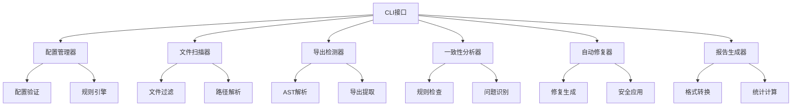
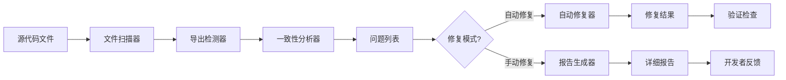

# Export Consistency System 文档

## 概述

Export Consistency System（导出一致性系统）是 Wendeal Dashboard 的核心代码质量保障工具，用于自动检测、分析和修复 TypeScript/JavaScript 项目的导出一致性问题。该系统通过静态代码分析技术，帮助开发团队维护代码库的规范性和一致性。

## 功能特性

### 🔍 智能检测
- **导出模式识别**: 自动识别命名导出、默认导出、重导出等各种导出模式
- **一致性分析**: 检测命名规范、导入导出匹配、循环依赖等问题
- **多文件分析**: 支持跨文件的导出一致性检查
- **增量扫描**: 只检查变更的文件，提高性能

### 🔧 自动修复
- **智能修复建议**: 提供具体的修复方案和代码示例
- **批量修复**: 支持批量应用修复建议
- **安全修复**: 提供备份和回滚功能
- **预览模式**: 支持修复预览，避免意外修改

### 📊 报告生成
- **多格式报告**: 支持控制台、JSON、HTML等多种报告格式
- **详细统计**: 提供错误数量、警告数量、影响文件等统计信息
- **历史追踪**: 记录修复历史和趋势分析
- **可视化展示**: HTML报告提供直观的图形化展示

### 🔗 集成支持
- **ESLint集成**: 与现有ESLint工作流无缝集成
- **Pre-commit钩子**: 自动在提交前进行一致性检查
- **CI/CD集成**: 支持在持续集成中运行检查
- **IDE插件**: 提供主流IDE的插件支持

## 系统架构

### 核心组件架构



### 数据流图



## 安装和配置

### 环境要求

- **Node.js**: >= 16.0.0
- **TypeScript**: >= 4.5.0
- **ESLint**: >= 8.0.0 (可选，用于集成)

### 安装依赖

```bash
# 安装核心依赖
npm install --save-dev typescript eslint @typescript-eslint/parser

# 安装导出一致性工具
npm install --save-dev commander
```

### 基本配置

```json
// package.json
{
  "scripts": {
    "check-exports": "node scripts/check-exports.js",
    "fix-exports": "node scripts/check-exports.js fix",
    "report-exports": "node scripts/check-exports.js report"
  }
}
```

## 使用指南

### 命令行接口

#### 扫描模式

扫描整个项目的导出一致性问题：

```bash
# 基本扫描
node scripts/check-exports.js scan

# JSON格式输出
node scripts/check-exports.js scan --json

# 指定特定目录
node scripts/check-exports.js scan src/components
```

#### 修复模式

自动修复检测到的问题：

```bash
# 预览修复（不实际修改文件）
node scripts/check-exports.js fix --dry-run

# 执行自动修复
node scripts/check-exports.js fix

# 修复特定文件
node scripts/check-exports.js fix src/components/Button.ts
```

#### 报告模式

生成详细的分析报告：

```bash
# 控制台报告
node scripts/check-exports.js report

# JSON格式报告
node scripts/check-exports.js report --format json --output report.json

# HTML格式报告
node scripts/check-exports.js report --format html --output report.html
```

### ESLint集成

#### 配置规则

```javascript
// eslint.config.js
export default [
  {
    files: ['**/*.{ts,tsx}'],
    rules: {
      // 导出一致性规则
      '@typescript-eslint/consistent-type-exports': 'error',
      '@typescript-eslint/consistent-type-imports': [
        'error',
        { prefer: 'type-imports' }
      ],
      'import/no-duplicates': 'error',
      'import/export': 'error',

      // 自定义规则
      'export-consistency/no-mixed-exports': 'error',
      'export-consistency/naming-convention': 'warn'
    }
  }
];
```

#### Pre-commit集成

```json
// .lintstagedrc.json
{
  "src/**/!(test-utils).{ts,tsx}": [
    "prettier --write",
    "node scripts/check-exports.js scan --json"
  ],
  "src/**/*.{js,jsx}": [
    "prettier --write",
    "node scripts/check-exports.js scan --json"
  ]
}
```

## 检测规则

### 命名规范规则

#### PascalCase组件命名
```typescript
// ✅ 正确
export const Button = () => <button>Click me</button>;

// ❌ 错误
export const button = () => <button>Click me</button>;
```

#### camelCase函数命名
```typescript
// ✅ 正确
export const formatDate = (date: Date) => date.toISOString();

// ❌ 错误
export const FormatDate = (date: Date) => date.toISOString();
```

### 导出模式规则

#### 避免混合导出
```typescript
// ❌ 不推荐 - 混合默认和命名导出
export const Component = () => <div />;
export default Component;

// ✅ 推荐 - 只使用命名导出
export const Component = () => <div />;
export { Component as default };
```

#### 一致的重导出
```typescript
// ✅ 正确 - 一致的重导出模式
export { Button } from './Button';
export { Input } from './Input';
export type { ButtonProps } from './Button';

// ❌ 错误 - 混合重导出模式
export { Button } from './Button';
export * from './Input';
```

### 导入导出匹配规则

#### 相对路径导入
```typescript
// ✅ 正确 - 使用相对路径
import { Button } from './components/Button';

// ❌ 错误 - 使用绝对路径
import { Button } from 'src/components/Button';
```

#### 类型导入分离
```typescript
// ✅ 正确 - 分离类型导入
import type { User } from './types';
import { formatUser } from './utils';

// ❌ 错误 - 混合导入
import { formatUser, type User } from './utils';
```

## 修复示例

### 自动修复场景

#### 命名规范修复
```typescript
// 原始代码
export const button = () => <div>Button</div>;

// 修复后
export const Button = () => <div>Button</div>;
```

#### 导入路径修复
```typescript
// 原始代码
import { Button } from 'src/components/Button';

// 修复后
import { Button } from './components/Button';
```

#### 导出去重修复
```typescript
// 原始代码
export { Button } from './Button';
export { Button as Btn } from './Button';

// 修复后
export { Button, Button as Btn } from './Button';
```

## 报告解读

### 控制台报告示例

```
🔍 Export Consistency Report
Project: wendeal-dashboard
Time: 2024-01-15T10:30:00.000Z

Check Results:
  ✅ TypeScript Compilation: Passed
  ✅ ESLint Check: Passed
  ✅ Duplicate Export Check: Passed

📊 Summary:
  - Files analyzed: 45
  - Total exports: 156
  - Issues found: 0
  - Clean project! 🎉
```

### JSON报告结构

```json
{
  "timestamp": "2024-01-15T10:30:00.000Z",
  "project": "wendeal-dashboard",
  "checks": {
    "typescript": true,
    "eslint": true,
    "duplicateExports": true
  },
  "summary": {
    "filesAnalyzed": 45,
    "totalExports": 156,
    "issues": [],
    "statistics": {
      "errors": 0,
      "warnings": 0,
      "filesWithIssues": 0
    }
  }
}
```

## 最佳实践

### 项目配置

#### 大型项目配置
```json
{
  "exportConsistency": {
    "patterns": [
      "src/**/*.{ts,tsx}",
      "!src/**/*.test.{ts,tsx}",
      "!src/**/*.spec.{ts,tsx}"
    ],
    "rules": {
      "namingConvention": "strict",
      "allowMixedExports": false,
      "maxExportPerFile": 10
    },
    "ignore": [
      "node_modules/**",
      "dist/**",
      "coverage/**"
    ]
  }
}
```

#### 团队规范
```json
{
  "team": {
    "naming": {
      "components": "PascalCase",
      "functions": "camelCase",
      "constants": "SCREAMING_SNAKE_CASE",
      "types": "PascalCase"
    },
    "exports": {
      "preferNamed": true,
      "allowDefault": false,
      "groupRelated": true
    }
  }
}
```

### CI/CD集成

#### GitHub Actions示例
```yaml
# .github/workflows/export-consistency.yml
name: Export Consistency Check

on: [push, pull_request]

jobs:
  check-exports:
    runs-on: ubuntu-latest

    steps:
    - uses: actions/checkout@v3

    - name: Setup Node.js
      uses: actions/setup-node@v3
      with:
        node-version: '18'

    - name: Install dependencies
      run: npm ci

    - name: Check export consistency
      run: npm run check-exports

    - name: Generate report
      run: npm run report-exports
```

#### Jenkins Pipeline示例
```groovy
pipeline {
    agent any

    stages {
        stage('Export Consistency Check') {
            steps {
                sh 'npm run check-exports'
            }
            post {
                always {
                    sh 'npm run report-exports -- --format html --output export-report.html'
                    publishHTML([
                        allowMissing: false,
                        alwaysLinkToLastBuild: true,
                        keepAll: true,
                        reportDir: '.',
                        reportFiles: 'export-report.html',
                        reportName: 'Export Consistency Report'
                    ])
                }
            }
        }
    }
}
```

## 故障排除

### 常见问题

#### TypeScript编译错误
**问题**: `tsc --noEmit` 报告编译错误
**解决方法**:
1. 检查TypeScript配置文件
2. 确保所有依赖都已安装
3. 运行 `npm run type-check` 单独检查类型

#### ESLint配置冲突
**问题**: ESLint规则与其他插件冲突
**解决方法**:
1. 检查ESLint配置顺序
2. 使用规则覆盖解决冲突
3. 考虑禁用冲突规则

#### 内存不足错误
**问题**: 大型项目分析时内存不足
**解决方法**:
1. 增加Node.js内存限制: `node --max-old-space-size=4096`
2. 分批处理文件
3. 使用增量分析模式

#### 误报问题
**问题**: 检测到并非真正的问题
**解决方法**:
1. 检查配置文件规则
2. 添加忽略模式
3. 自定义规则配置

### 性能优化

#### 大型项目优化
- 使用增量分析模式
- 配置忽略不需要检查的文件
- 启用并行处理
- 使用缓存机制

#### 开发环境优化
- 配置预提交钩子只检查变更文件
- 使用快速模式跳过详细分析
- 配置IDE插件实时检查

## 版本历史

### v1.0.0 (2024-01-15)
- ✅ 初始版本发布
- ✅ 基础导出检测功能
- ✅ TypeScript编译检查
- ✅ ESLint集成
- ✅ 命令行界面
- ✅ 基础报告功能

### v1.1.0 (计划中)
- 🔄 高级重构建议
- 🔄 IDE插件支持
- 🔄 自定义规则引擎
- 🔄 性能监控和优化
- 🔄 云端报告服务

## 贡献指南

### 开发环境设置

1. Fork项目
2. 克隆到本地
3. 安装依赖: `npm install`
4. 运行测试: `npm test`
5. 开始开发

### 代码规范

#### 提交信息格式
```
feat: add new export consistency rule
fix: resolve TypeScript compilation issue
docs: update user guide
test: add integration test for CLI
```

#### 分支命名
```
feature/export-consistency-rule
fix/typescript-compilation
docs/update-guide
test/cli-integration
```

### 测试要求

#### 单元测试覆盖率
- 核心工具类: > 90%
- CLI接口: > 80%
- 错误处理: > 95%

#### 集成测试场景
- 完整工作流测试
- 错误恢复测试
- 性能基准测试
- 边界条件测试

## 支持与反馈

### 获取帮助
- 📖 查看本文档
- 🐛 提交问题: [GitHub Issues](https://github.com/your-repo/issues)
- 💬 讨论交流: [GitHub Discussions](https://github.com/your-repo/discussions)
- 📧 邮件支持: support@wendeal.com

### 社区资源
- 📚 [使用指南](https://docs.wendeal.com/export-consistency)
- 🎥 [视频教程](https://youtube.com/wendeal)
- 💡 [最佳实践](https://blog.wendeal.com/export-consistency)
- 🔧 [配置示例](https://github.com/wendeal/export-consistency-examples)

---

*最后更新: 2024年9月7日*
