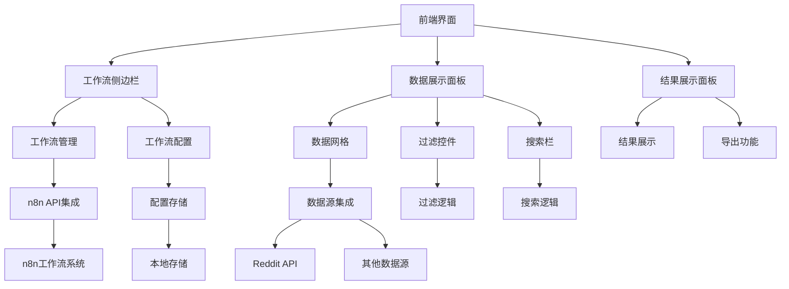
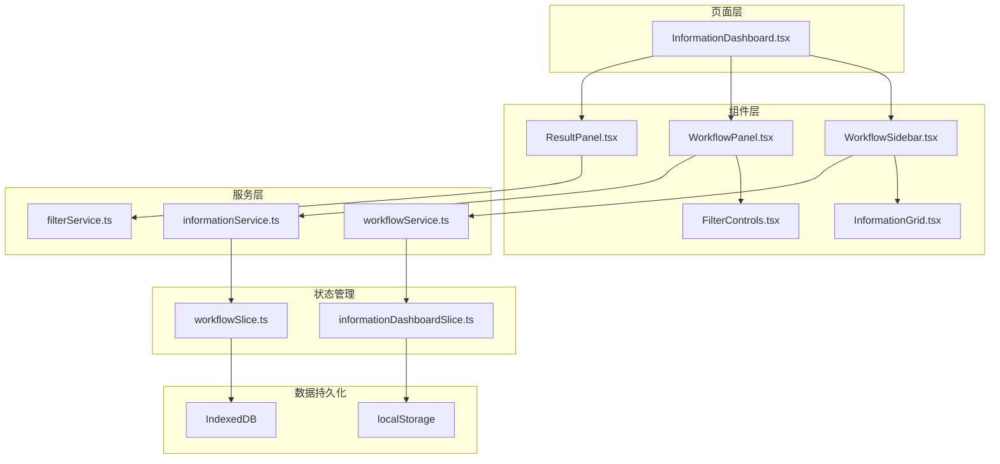

# Information Dashboard 功能文档

## 概述

Information Dashboard（信息仪表板）是 Wendeal Dashboard 的核心功能模块，提供统一的信息聚合、展示和管理系统。该模块集成了多个数据源和工作流系统，为用户提供全面的数据洞察和操作界面。

## 功能特性

### 📊 数据聚合展示
- **多源数据集成**: 支持Reddit、n8n工作流等多种数据源
- **实时数据更新**: 自动刷新和实时数据同步
- **可视化展示**: 图表、表格、卡片等多种展示形式
- **数据过滤排序**: 强大的搜索、过滤和排序功能

### 🔄 工作流管理
- **工作流列表**: 显示所有可用的n8n工作流
- **手动触发**: 支持手动执行工作流
- **状态监控**: 实时显示工作流执行状态
- **历史记录**: 完整的工作流执行历史

### 🎯 智能数据处理
- **Reddit数据收集**: 集成Reddit API数据收集
- **数据持久化**: 本地数据存储和管理
- **智能过滤**: 基于关键词、时间、分数等条件过滤
- **数据导出**: 支持多种格式的数据导出

### ⚙️ 系统配置
- **工作流配置**: 自定义工作流参数设置
- **权限管理**: 基于角色的访问控制
- **主题设置**: 支持深色/浅色主题切换
- **国际化**: 多语言界面支持

## 技术架构

### 系统架构图



### 核心组件架构



## 使用指南

### 快速开始

1. **访问仪表板**
   ```
   导航到: 信息仪表板 (/information-dashboard)
   ```

2. **查看数据**
   - 页面加载后自动显示最新的Reddit数据
   - 数据按时间倒序排列显示

3. **管理工作流**
   - 在左侧侧边栏查看可用的工作流
   - 点击工作流卡片查看详细信息
   - 使用"执行"按钮手动触发工作流

### 数据操作

#### 搜索和过滤

```typescript
// 基础搜索
输入关键词: "technology" 或 "AI"

// 高级过滤
- 时间范围: 选择"今天"、"本周"等
- 分数过滤: 设置最小分数阈值
- 子版块: 指定特定subreddit
- 关键词: 添加多个关键词过滤
```

#### 数据排序

```typescript
// 支持的排序方式
- 时间排序 (最新/最旧)
- 分数排序 (最高/最低)
- 评论数排序 (最多/最少)
- 标题排序 (A-Z/Z-A)
```

#### 数据导出

```typescript
// 支持格式
- JSON: 完整数据结构
- CSV: 表格格式数据
- Markdown: 格式化文本
```

### 工作流管理

#### 创建工作流

1. 点击"新建工作流"按钮
2. 选择工作流类型 (Reddit数据收集)
3. 配置工作流参数:
   ```json
   {
     "subreddit": "technology",
     "limit": 25,
     "timeFilter": "day",
     "sortBy": "hot"
   }
   ```
4. 保存配置

#### 执行工作流

1. 在工作流列表中选择目标工作流
2. 点击"执行"按钮
3. 监控执行进度
4. 查看执行结果

#### 配置工作流

1. 点击工作流卡片上的设置图标
2. 修改参数配置
3. 保存更改
4. 重新执行以应用新配置

## API 接口

### 工作流相关接口

#### 获取工作流列表
```typescript
GET /api/workflows
Response: {
  success: boolean,
  data: Workflow[],
  total: number
}
```

#### 执行工作流
```typescript
POST /api/workflows/{id}/execute
Request: {
  parameters?: object
}
Response: {
  success: boolean,
  data: {
    executionId: string
  }
}
```

#### 获取执行历史
```typescript
GET /api/workflows/{id}/executions
Response: {
  success: boolean,
  data: WorkflowExecution[],
  total: number
}
```

### 数据相关接口

#### 获取Reddit数据
```typescript
GET /api/reddit/data
Query Parameters: {
  subreddit?: string,
  limit?: number,
  timeFilter?: string,
  sortBy?: string
}
Response: {
  success: boolean,
  data: ParsedSubredditData[]
}
```

#### 搜索数据
```typescript
GET /api/information/search
Query Parameters: {
  keyword?: string,
  dateFrom?: string,
  dateTo?: string,
  minScore?: number,
  subreddit?: string
}
Response: {
  success: boolean,
  data: InformationItem[],
  total: number
}
```

## 配置选项

### 工作流配置

```typescript
interface WorkflowSettings {
  // 基本信息
  name: string;
  description?: string;

  // 数据源配置
  subreddit: string;
  limit: number;

  // 过滤配置
  timeFilter: 'hour' | 'day' | 'week' | 'month' | 'year' | 'all';
  sortBy: 'hot' | 'new' | 'top' | 'rising';

  // 高级配置
  minScore?: number;
  includeComments?: boolean;
  enableNotifications?: boolean;
}
```

### 界面配置

```typescript
interface DashboardSettings {
  // 显示配置
  theme: 'light' | 'dark';
  language: 'zh-CN' | 'en-US';

  // 数据配置
  autoRefresh: boolean;
  refreshInterval: number; // 分钟

  // 布局配置
  sidebarCollapsed: boolean;
  defaultView: 'grid' | 'list' | 'card';
}
```

## 故障排除

### 常见问题

#### 数据不显示
**问题**: 页面加载后没有数据显示
**解决方法**:
1. 检查网络连接
2. 刷新页面
3. 查看浏览器控制台错误信息
4. 确认API服务是否正常运行

#### 工作流执行失败
**问题**: 点击执行按钮后工作流执行失败
**解决方法**:
1. 检查工作流配置是否正确
2. 确认n8n服务是否运行
3. 查看执行日志了解具体错误
4. 检查网络连接和API权限

#### 搜索无结果
**问题**: 使用搜索功能没有返回结果
**解决方法**:
1. 检查搜索关键词拼写
2. 尝试使用更简单的关键词
3. 调整时间范围设置
4. 清除所有过滤条件

### 性能优化

#### 前端优化
- **组件懒加载**: 按需加载组件减少初始包大小
- **数据分页**: 大数据集采用分页加载
- **缓存策略**: 利用浏览器缓存减少重复请求
- **防抖搜索**: 搜索输入防抖减少API调用

#### 后端优化
- **数据库索引**: 为常用查询字段建立索引
- **数据压缩**: 传输数据压缩减少带宽使用
- **缓存机制**: Redis缓存热点数据
- **异步处理**: 工作流异步执行不阻塞界面

## 开发指南

### 组件开发规范

#### 命名约定
```typescript
// 组件文件命名
InformationDashboard.tsx      // 主页面组件
WorkflowSidebar.tsx          // 侧边栏组件
InformationGrid.tsx          // 数据网格组件

// 组件命名
export const WorkflowCard: React.FC = () => { ... }
export const FilterControls: React.FC = () => { ... }
```

#### Props接口定义
```typescript
interface WorkflowCardProps {
  workflow: Workflow;
  onExecute: (id: string) => void;
  onConfigure: (id: string) => void;
  loading?: boolean;
}
```

#### 状态管理
```typescript
// 使用Redux Toolkit
const informationDashboardSlice = createSlice({
  name: 'informationDashboard',
  initialState,
  reducers: {
    setWorkflows: (state, action) => {
      state.workflows = action.payload;
    },
    // ... 其他reducers
  },
});
```

### 测试策略

#### 单元测试
```typescript
describe('WorkflowCard', () => {
  test('renders workflow information correctly', () => {
    // 测试组件渲染
  });

  test('handles execute button click', () => {
    // 测试用户交互
  });
});
```

#### 集成测试
```typescript
describe('Information Dashboard Integration', () => {
  test('complete workflow execution flow', async () => {
    // 测试完整用户流程
  });
});
```

## 版本历史

### v1.0.0 (2024-01-01)
- ✅ 初始版本发布
- ✅ 基础工作流管理功能
- ✅ Reddit数据集成
- ✅ 数据展示和过滤
- ✅ 用户界面优化

### v1.1.0 (计划中)
- 🔄 多数据源支持
- 🔄 高级分析功能
- 🔄 自定义仪表板
- 🔄 实时数据推送

## 支持与反馈

### 获取帮助
- 📖 查看本文档
- 🐛 提交问题: [GitHub Issues](https://github.com/your-repo/issues)
- 💬 讨论交流: [GitHub Discussions](https://github.com/your-repo/discussions)

### 贡献指南
1. Fork项目
2. 创建特性分支 (`git checkout -b feature/AmazingFeature`)
3. 提交更改 (`git commit -m 'Add some AmazingFeature'`)
4. 推送分支 (`git push origin feature/AmazingFeature`)
5. 创建Pull Request

---

*最后更新: 2024年9月7日*
