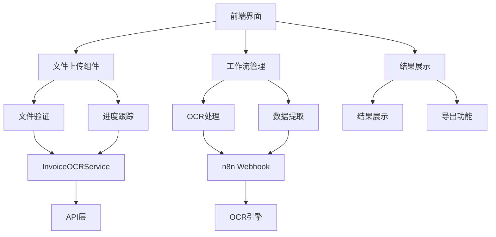

# Invoice OCR 功能文档

## 概述

Invoice OCR（发票光学字符识别）是 Wendeal Dashboard 的核心功能之一，提供了完整的发票文档处理和数据提取解决方案。该功能支持多种格式的发票文件上传，通过先进的OCR技术和AI算法自动提取结构化数据。

## 功能特性

### 📤 文件上传
- **支持格式**: PDF, JPG, JPEG, PNG, TIFF
- **文件大小限制**: 最大10MB
- **批量上传**: 支持同时上传多个文件
- **拖拽上传**: 友好的拖拽上传界面
- **进度显示**: 实时上传进度反馈

### 🤖 智能识别
- **OCR引擎**: 集成先进的OCR识别技术
- **多语言支持**: 中文、英文自动识别
- **数据提取**: 自动提取发票关键信息
  - 发票号码、日期、金额
  - 供应商和客户信息
  - 商品明细和税率
  - 付款信息

### 📊 数据管理
- **结果展示**: 清晰的OCR结果展示
- **数据验证**: 自动数据准确性验证
- **Google Sheets集成**: 一键导出到Google Sheets
- **历史记录**: 完整的处理历史追踪

### ⚙️ 工作流设置
- **自定义配置**: 可配置识别参数
- **批量处理**: 支持批量文件处理
- **通知设置**: 处理完成通知配置
- **权限控制**: 基于角色的访问控制

## 技术架构

### 系统架构图



### 核心组件

#### 1. InvoiceOCRPage (主页面)
```typescript
// 主页面组件，负责整体布局和状态协调
interface InvoiceOCRPageProps {
  // 页面级别的配置选项
}
```

#### 2. InvoiceFileUpload (文件上传)
```typescript
// 文件上传组件，支持拖拽和批量上传
interface InvoiceFileUploadProps {
  onFilesUploaded: (files: File[]) => void;
  maxFileSize: number;
  acceptedTypes: string[];
}
```

#### 3. InvoiceOCRResults (结果展示)
```typescript
// OCR结果展示和导出组件
interface InvoiceOCRResultsProps {
  results: InvoiceOCRResult[];
  onExportToSheets: () => void;
}
```

### 数据流

1. **文件上传阶段**
   ```
   文件选择 → 类型验证 → 大小检查 → 上传到服务器
   ```

2. **OCR处理阶段**
   ```
   文件接收 → OCR引擎处理 → 数据提取 → 结构化输出
   ```

3. **结果展示阶段**
   ```
   数据接收 → 格式化展示 → 用户确认 → 导出或保存
   ```

## API 接口

### 文件上传接口
```typescript
POST /api/invoice-ocr/upload
Content-Type: multipart/form-data

// 请求参数
{
  files: File[],           // 上传的文件列表
  options: {
    language: 'auto',      // 识别语言
    outputFormat: 'json'   // 输出格式
  }
}

// 响应格式
{
  success: true,
  data: {
    batchId: string,
    files: [{
      id: string,
      status: 'processing',
      progress: 0
    }]
  }
}
```

### 处理结果查询
```typescript
GET /api/invoice-ocr/results/{batchId}

// 响应格式
{
  success: true,
  data: {
    status: 'completed',
    results: [{
      fileId: string,
      extractedData: {
        invoiceNumber: string,
        amount: number,
        vendor: string,
        // ... 其他提取的数据
      },
      confidence: 0.95
    }]
  }
}
```

## 使用指南

### 基本使用流程

1. **访问功能页面**
   ```
   登录系统 → 导航到信息仪表板 → 点击"Invoice OCR"卡片
   ```

2. **上传文件**
   ```
   拖拽文件到上传区域 或 点击选择文件 → 等待上传完成
   ```

3. **启动处理**
   ```
   点击"运行"按钮 → 系统自动开始OCR处理 → 查看处理进度
   ```

4. **查看结果**
   ```
   处理完成后查看提取的数据 → 确认准确性 → 导出到Google Sheets
   ```

### 高级配置

#### 工作流设置
- **识别语言**: 选择主要语言（中文/英文/自动）
- **输出格式**: 选择数据输出格式（JSON/CSV/Excel）
- **置信度阈值**: 设置最低识别准确度要求
- **批量处理**: 配置并发处理数量

#### 通知设置
- **处理完成通知**: 开启/关闭完成提醒
- **失败通知**: 开启/关闭失败提醒
- **邮件通知**: 配置通知接收邮箱

## 故障排除

### 常见问题

#### 1. 文件上传失败
**问题**: 文件无法上传或上传过程中断
**解决方案**:
- 检查文件格式是否支持（PDF/JPG/PNG等）
- 确认文件大小不超过10MB限制
- 检查网络连接是否正常
- 尝试重新上传文件

#### 2. OCR识别不准确
**问题**: 识别结果准确度不高
**解决方案**:
- 确保图片质量清晰，对比度适中
- 检查文件是否为扫描件或拍照件
- 尝试调整图片亮度和角度
- 使用更高分辨率的原始文件

#### 3. Google Sheets导出失败
**问题**: 无法导出到Google Sheets
**解决方案**:
- 检查Google账户权限
- 确认网络连接正常
- 刷新页面后重试
- 检查Google Sheets链接是否正确

### 错误代码说明

| 错误代码 | 说明 | 解决方案 |
|---------|------|---------|
| UPLOAD_001 | 文件格式不支持 | 检查文件格式，使用支持的格式 |
| UPLOAD_002 | 文件过大 | 压缩文件或分割大文件 |
| OCR_001 | 图片质量太差 | 提高图片质量和清晰度 |
| OCR_002 | 文字识别失败 | 检查文字是否清晰可辨 |
| EXPORT_001 | 导出权限不足 | 检查Google账户权限 |

## 性能优化

### 前端优化
- **文件预处理**: 客户端文件压缩和格式转换
- **分片上传**: 大文件分片上传，提高成功率
- **缓存策略**: 缓存已处理结果，避免重复处理

### 后端优化
- **异步处理**: 使用队列系统处理大量文件
- **负载均衡**: 多实例部署，提高并发处理能力
- **缓存机制**: 缓存OCR结果，减少重复计算

### 监控指标
- **处理速度**: 平均每张发票处理时间
- **准确率**: OCR识别准确度统计
- **成功率**: 文件处理成功率
- **用户满意度**: 用户反馈和评分

## 安全考虑

### 数据安全
- **传输加密**: HTTPS传输保护数据安全
- **存储加密**: 敏感数据加密存储
- **访问控制**: 基于角色的权限控制

### 文件安全
- **类型验证**: 严格的文件类型检查
- **内容扫描**: 防止恶意文件上传
- **清理机制**: 定期清理临时文件

## 测试策略

### 单元测试
- **组件测试**: 各组件功能和交互测试
- **服务测试**: API调用和数据处理测试
- **工具函数测试**: 工具函数正确性测试

### 集成测试
- **上传流程**: 完整文件上传和处理流程
- **识别流程**: OCR识别和数据提取流程
- **导出流程**: 数据导出和第三方集成流程

### E2E测试
- **用户场景**: 完整用户使用场景测试
- **边界情况**: 异常情况和边界条件测试
- **性能测试**: 高并发和大文件处理测试

## 维护指南

### 版本更新
1. **功能更新**: 新功能开发和现有功能优化
2. **依赖更新**: 定期更新第三方依赖包
3. **安全补丁**: 及时应用安全漏洞修复

### 监控和告警
1. **性能监控**: 响应时间和吞吐量监控
2. **错误监控**: 系统错误和异常监控
3. **用户反馈**: 收集和分析用户反馈

### 备份和恢复
1. **数据备份**: 定期备份用户数据和配置
2. **日志备份**: 保存系统运行日志
3. **灾难恢复**: 制定灾难恢复预案

## 未来规划

### 短期目标 (3个月内)
- [ ] 支持更多文件格式 (Word, Excel)
- [ ] 增加手动校正功能
- [ ] 优化移动端体验

### 中期目标 (6个月内)
- [ ] AI模型升级，提高识别准确率
- [ ] 多语言支持扩展
- [ ] 批量处理性能优化

### 长期目标 (1年内)
- [ ] 行业特定模板定制
- [ ] 智能分类和标签功能
- [ ] 第三方系统集成扩展

## 联系支持

如有问题或建议，请通过以下方式联系：
- **技术支持**: tech-support@wendeal.com
- **产品反馈**: product-feedback@wendeal.com
- **文档更新**: docs@wendeal.com

---

*最后更新: 2024年9月6日*
*版本: 1.0.0*
